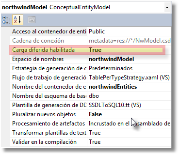
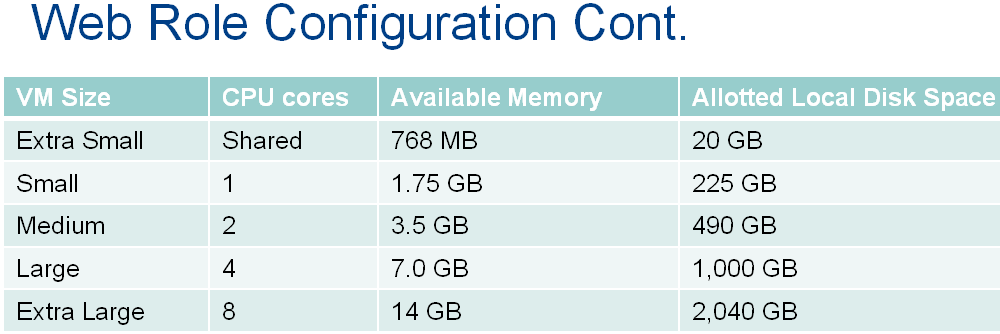

CAPITULO 1.

* Transparencia 1.
* Transparencia 10. (Escalabilidad)
* Transparencia 22. (IaaS, PaaS and SaaS, maquina vacía)
* Transparencia 23. (Con unos cimientos)
* Transparencia 24. (Servidor instalado y tu montas las aplicaciones)

CAPITULO 2.

* Transparencia 3.
* Transparencia 4.
* Transparencia 5.
* Transparencia 53. (Resumen de Azure a nivel de desarrollo.)
Se puede trabajar en local o en la nube. (ahora los 30 primeros días son gratis pero hay que poner una tarjeta de credito.)
Windows Azure, ejecución, almacenamiento (No son bases de datos SQL Server, no son bases de datos, management.
La parte de abajo es la parte física, lo de arriba son aplicaciones.
* Transparencia 57
Se pueden montar tres tipos de cosas.
	* VM Role.- Máquinas virtuales. Hay que comprar y montar OS, servidor IIS, etc... (utilizan HyperV)
	* Web Role.- Para montar Pagina Web, Servicio Web (algo más configurado).
	Maquinas virtuales orientasdas y preconfiguradas para exponer sitios Web.
	* Worker Role.- Procesos secundarios. Exponen funcionalidades pero internamente en la máquina virtual (librería)
* Transparencia 59.
Modelo habitual de aplicaciones Web.
* Transparencia 61.
Formas de almacenar información en la nube.
* Almacenamiento Local.- Es un espacio físico reservado en cada ROL y para cada instancia de ROL, para guardar información **temporal** como si fuera un sistema de archivos.
* Storage.- El almacenamiento de Azure NO es el SQL Azure.
* Queue storage.- Objetos que van a permitir que un ROL se comunique con otro ROL de manera que desde uno se va ha enviar a la Queue una información y el otro ROL recogerá cuando quiera. Esto permite que no sea necesario que estén activos los dos roles. Es la comunicación estandar entre roles en Azure. (tipo texto, limitado de tamaño 8k)
* Table storage.- Contenedores de datos de cualquier tipo de clase (la tabla no tiene estructura). No admite ningún tipo de indices, porque ya trae implicito un sistema de clave primaria y no permiten relaciones, bastante rápido y eficiente.
* Blob.- (Binary Large OBject) (Video, ZIP, Música, Imágenes, etc...)Sistema de almacenamiento de archivos binarios. La estructura no es real pero se parece a la de directorios.
* Azure Drive.- No se utiliza. Era como una unidad de red virtual en la nube, era un envoltorio para manejar los blob.
* Transparencia 64.
Off-Premise.- que están en la nube.
On-Premise.- Deben cumplir unos requisitos y no están en la nube.

Todas pueden acceder a la información en la nube por la API REST que es HTTP.

Si uso .NET puedo usar la API de cliente de almacenamiento. Que envuelve la Api REST.

* Transparencia 72.
Hay dos emuladores en cliente, el de ejecución y el de datos.
El emulador de datos necesita SQL Express para almacenar los datos.

Abrimos Visual Studio en modo Administrador (sino no tendremos acceso a AZURE)

Seleccionando el proyecto de azure boton derecho propiedades En la pestaña Web. Si uso el emulador rápido no es necesario abrir el Visual Studio como Administrador.

La estructura de directorios de nuestra aplicación AZURE será lo siguiente.

/Solución
  -\Proyecto Azure
  -\WebRole
  -\Role Work
  -\Role Datos

Configuración del proyecto AZURE.

Con extensión .csdef (Cloud Service Definition) contiene configuración fija para todo el proyecto AZURE. Si se cambia debe volverse a subir a la nube. Cambia la estructura y comportamiento de la aplicación.

Ejemplo:

    <ConfigurationSettings>
      <Setting name="Programador" />
    </ConfigurationSettings>

Con extensión .cscfg (Cloud Service Configuration) Contienen configuración de usuario o del proyecto pero NO fija. No es necesario implementar de nuevo la aplicación ej.: `<Instances count="1" />`. NO cambia la estructura y comportamiento de la aplicación.

Ejemplo:

    <Role name="InterfazWeb">
      <Instances count="3" />
      <ConfigurationSettings>
        <Setting name="Microsoft.WindowsAzure.Plugins.Diagnostics.ConnectionString" value="UseDevelopmentStorage=true" />
        <Setting name="Programador" value="Carlos Callado" />
      </ConfigurationSettings>
    </Role>

Configuración del Rol Web (InterfaceWeb)
Botón derecho sobre él, propiedades y aparece la siguiente pantalla.

Tamaño de VM:
Extra grande.
Grande
Mediano
Pequeño.-
Extra pequeño.- Es la más barata pero compartida con otros usuarios.

El primer valor de configuración es la conexión a Azure, en nuestro caso contra el emulador.

Las variables de sesión en Azure como tenemos varias instancias puede que la instancia que ha creado la variable y ha dado un valor, si entro a otra instancia la variable no existirá o tendrá un valor que no es el último que hemos dejado en la anterior instancia.

Para poner un valor de configuración en la Página Maestra lo vamos hacer en Global.asax.cs
En el evento Application_Start ponemos el código. De esta forma no la tenemos que volver a cargar.

En el Global.asax.cs

    //Me creo una variable de aplicación, en Azure al poder haber varias instancias
    //mejor no usar las variables Session.
    Application["Programador"] = 
    		Microsoft.WindowsAzure.ServiceRuntime
                     .RoleEnvironment.GetConfigurationSettingValue("Programador");

Y en el Page_Load

	if (!Page.IsPostBack)
    	Label1.Text = "Programador: " + Application["Programador"];

No puedo referenciar un rol con otro lo tendré que hacer con colas de mensajes.

**Colas de mensajes AZURE**.- Sirven para intercambiar mensajes de texto o arrays de bytes entre roles.

Tienes que saber la dirección de la cola y el contenido.

