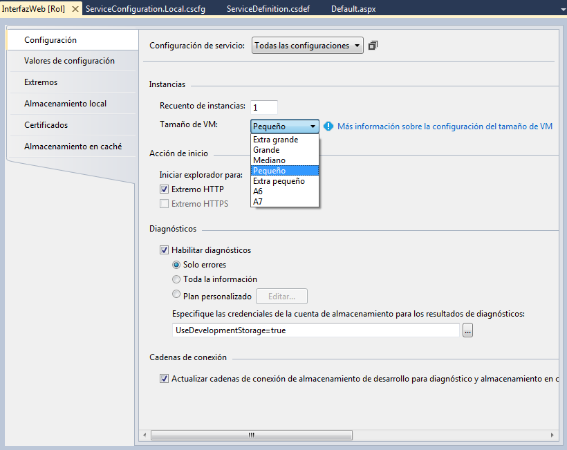
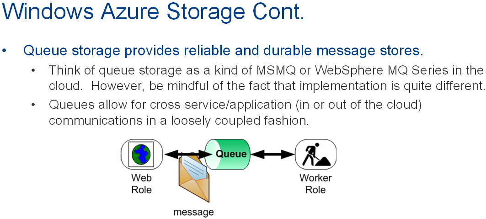

CAPITULO 1.

###Introducción al Cloud Computing

**Escalabilidad**

**IaaS** máquina vacía

**PaaS** Con unos cimientos

**SaaS** Servidor instalado y tu montas las aplicaciones

Herramienta Windows Application Toolkit **WAT**

Un proyecto Web Role tiene la apariencia de un proyecto normal APP.NET.

(Resumen de Azure a nivel de desarrollo.)

Se puede trabajar en local o en la nube. (ahora los 30 primeros días son gratis pero hay que poner una tarjeta de credito.)

Windows Azure, ejecución, almacenamiento (No son bases de datos SQL Server, no son bases de datos, management.
La parte de abajo es la parte física, lo de arriba son aplicaciones.

Se pueden montar tres tipos de cosas.

* **VM Role**.- Máquinas virtuales. Hay que comprar y montar OS, servidor IIS, etc... (utilizan HyperV)
* **Web Role**.- Para montar Pagina Web, Servicio Web (algo más configurado).
Maquinas virtuales orientasdas y preconfiguradas para exponer sitios Web.
* **Worker Role**.- Procesos secundarios. Exponen funcionalidades pero internamente en la máquina virtual (librería)

Modelo habitual de aplicaciones Web.

Formas de almacenar información en la nube.

* **Almacenamiento Local**.- Es un espacio físico reservado en cada ROL y para cada instancia de ROL, para guardar información **temporal** como si fuera un sistema de archivos.
* **Storage*.- El almacenamiento de Azure NO es el SQL Azure.
* **Queue storage**.- Objetos que van a permitir que un ROL se comunique con otro ROL de manera que desde uno se va ha enviar a la Queue una información y el otro ROL recogerá cuando quiera. Esto permite que no sea necesario que estén activos los dos roles. Es la comunicación estandar entre roles en Azure. (tipo texto, limitado de tamaño **8k**)
* **Table storage**.- Contenedores de datos de cualquier tipo de clase (la tabla no tiene estructura). No admite ningún tipo de indices, porque ya trae implicito un sistema de clave primaria y no permiten relaciones, bastante rápido y eficiente.
* **Blob**.- (Binary Large OBject) (Video, ZIP, Música, Imágenes, etc...)Sistema de almacenamiento de archivos binarios. La estructura no es real pero se parece a la de directorios.
* ***Azure Drive***.- No se utiliza. Era como una unidad de red virtual en la nube, era un envoltorio para manejar los blob.

* **Off-Premise**.- que están en la nube.
* **On-Premise**.- Deben cumplir unos requisitos y no están en la nube.

Todas pueden acceder a la información en la nube por la API REST que es HTTP.

Si uso .NET puedo usar la API de cliente de almacenamiento. Que envuelve la Api REST.

Hay dos emuladores en cliente, el de ejecución y el de datos.
El emulador de datos necesita SQL Express para almacenar los datos.

Abrimos Visual Studio en modo Administrador (sino no tendremos acceso a AZURE)

Seleccionando el proyecto de azure botón derecho propiedades En la pestaña Web. Si uso el emulador rápido no es necesario abrir el Visual Studio como Administrador.

La estructura de directorios de nuestra aplicación AZURE será lo siguiente.

/Solución  
   -\Proyecto Azure  
   -\WebRole  
   -\Role Work  
   -\Role Datos  

Configuración del proyecto AZURE.

Con extensión **.csdef** (Cloud Service Definition) contiene configuración **fija** para todo el proyecto AZURE. Si se cambia debe volverse a subir a la nube. Cambia la estructura y comportamiento de la aplicación.

Ejemplo:

    <ConfigurationSettings>
      <Setting name="Programador" />
    </ConfigurationSettings>

Con extensión **.cscfg** (Cloud Service Configuration) Contienen configuración de usuario o del proyecto pero **NO fija**. No es necesario implementar de nuevo la aplicación ej.: `<Instances count="1" />`. NO cambia la estructura y comportamiento de la aplicación.

Ejemplo:

    <Role name="InterfazWeb">
      <Instances count="3" />
      <ConfigurationSettings>
        <Setting name="Microsoft.WindowsAzure.Plugins.Diagnostics.ConnectionString" value="UseDevelopmentStorage=true" />
        <Setting name="Programador" value="Carlos Callado" />
      </ConfigurationSettings>
    </Role>

Configuración del Rol Web (InterfaceWeb). Botón derecho sobre él, propiedades y aparece la siguiente pantalla.

Tamaño de VM:
Extra grande.
Grande
Mediano
Pequeño.-
Extra pequeño.- Es la más barata pero compartida con otros usuarios.

El primer valor de configuración es la conexión a Azure, en nuestro caso contra el emulador.

Las variables de sesión en Azure como tenemos varias instancias puede que la instancia que ha creado la variable y ha dado un valor, si entro a otra instancia la variable no existirá o tendrá un valor que no es el último que hemos dejado en la anterior instancia.

Para poner un valor de configuración en la Página Maestra lo vamos hacer en Global.asax.cs
En el evento Application_Start ponemos el código. De esta forma no la tenemos que volver a cargar.

En el Global.asax.cs

    //Me creo una variable de aplicación, en Azure al poder haber varias instancias
    //mejor no usar las variables Session.
    Application["Programador"] = 
    		Microsoft.WindowsAzure.ServiceRuntime
                     .RoleEnvironment.GetConfigurationSettingValue("Programador");

Y en el Page_Load

	if (!Page.IsPostBack)
    	Label1.Text = "Programador: " + Application["Programador"];

No puedo referenciar un rol con otro lo tendré que hacer con colas de mensajes.

**Colas de mensajes AZURE**.- Sirven para intercambiar mensajes de *texto o arrays de bytes* entre roles.

Tienes que saber la dirección de la cola y el contenido.

Todo tránsito (colas de mensajes, blob, etc...) en tu grupo de afinidad es gratis. La comunicación con el cliente no es gratis.

###Limitaciones especiales para las colas de mensajes.

* **No hay límite** en cantidad de **colas de mensajes** ni cantidad de **mensajes** en cada cola. (Pero se paga por el espacio ocupado)
* Los mensajes están limitados a **8 kb**.
* Por defecto los mensajes se mantienen encolados **1 semana**.

###Reglas de los nombres de las colas de mensajes.

* Deben ser únicos en nuestra cuenta de almacenamiento.
* Deben empezar por letra o número. (Solo pueden contener letras y números).
* Letras en minúsculas.
* Entre 3 y 63 caracteres de longitud.

Todo el almacenaje está por triplicado (sin coste) por temas de seguridad y balanceo de carga.

###Método general para acceder a Colas, Tablas o Blobs.

Acceder cuenta de almacenamiento nos creamos un cliente para acceder a "colas" a través de este cliente obtendremos una referencia a la "cola" 

Podemos crearla si no existe, Creamos mensaje, Leemos mensaje, Borramos todos los mensajes, etc...

	//Cuenta de almacenamiento local
    //Accedo a la cuenta
    CloudStorageAccount cuentaAlmacenamiento = CloudStorageAccount.DevelopmentStorageAccount;
    
    //Creo un cliente
    CloudQueueClient clienteColas = cuentaAlmacenamiento.CreateCloudQueueClient();
    
    string nombre = RoleEnvironment.GetConfigurationSettingValue("NombreColaMensages");
    
    //Obtenemos una referencia a la cola física
    CloudQueue cola = clienteColas.GetQueueReference(nombre);
    //Creo si no existe la cola
    cola.CreateIfNotExists();

En el emulador estos mensajes los guarda en una base de datos de MSSQL

Una vez que leo un mensaje desaparece durante 30 segundos para que no lo lea otra vez pasados estos 30 segundos reaparece a no ser que des la orden de borrarle.

###Table Storage

* En algunos casos van a suplir las bases de datos. (Te van a ahorrar mucho dinero)
* Son grandes conjuntos de entidades accesibles mediante unos métodos (que tendremos que crear nosotros) y que podrán contener diferentes tipos de entidades.
* Son muy escalables, miles de millones de entidades. (Limitado por Precio)
* Se replica tres veces por cuestiones de seguridad.
* No tienen un esquema o estructura concretos.
* No admiten relaciones.
* No se pueden hacer consultas que afecten a más de una tabla.
* Los datos de una tabla pueden estar en uno o varios servidores diferentes, pero de una tabla los datos de una partición siempre estarán en el mismo servidor.

####Reglas para los nombres de las tablas.

* Únicos en todo el almacenamiento. 
* Solo puede contener letras y números y tiene que empezar con letra.
* Sensibles a mayúsculas/minúsculas.
* Entre 3 y 63 caracteres.

Las entidades deben cumplir una determinadas características.

Deben tener tres campos/propiedades especiales.
* **PartitionKey**.- string que determina la partición a la que pertenece la entidad.
* **RowKey**.- Clave de la entidad para una partición concreta.
* **Timestamp**.- Lo que contiene es la fecha y hora de creación de la entidad en la tabla o la de última modificación. (Este valor lo gestiona el sistema, no lo podemos tocar.)

####Características de las entidades.

* Limitadas a 255 incluidas esas tres.
* Tamaño máximo por entidad 1 Mb.
* PartitionKey y RowKey no pueden superar 1 Kb cada una. 
* Ninguna de las dos pueden contener los siguientes caracteres `/\#?`
* Los tipos de datos del resto de propiedades (datos de usuario) pueden ser de tipos concretos no de cualquier tipo. *(byte[], bool, DateTime, double, Guid, Int32 or int, Int64 or long, String)*.

* **PropertyBag** Todas las propiedades menos las tres especiales.

En la parte de código de .NET en un rol le puedo decir cuando se arranque la instancia del rol que se ejecute el código que quiera, esto se encuentra en el fichero **WebRole.cs**

Además del OnStart existe un OnStop y un Run.

En los WorkerRole ya viene definido un Run en el WorkerRole.cs.

En un principio lo único que hace es mandar cada 10 segundos manda un mensaje al trace.

Para poder trabajar con cada una de las tablas nos tendremos que crear una clase que hereda de un tipo especial que nos dará las funcionalidades para poder trabajar con los datos de la tabla.

Nota: Las operaciones básicas (insertar, modificar y borrar) las crea automáticamente, pero las consultas hay que currárselas.

