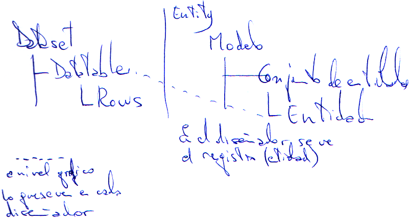

##Datos

Usaremos el control Multiview 

Por defecto no pone visible ninguna view.  
La propiedad **ActiveViewIndex** no dice o nos permite poner la vista activa indicandole el **índice de la vista**.  
Hay un método **SetActiveView** que nos permite poner la vista activa y nos pide el **nombre de la vista**.  
En el directorio **App_Data** es donde van a estar los ficheros de datos.
En .Net hay carpertas especiales ASP.NET (**Bin, App_Code, App_GlobalResources, App_LocalResource, App_Data**, etc...)
Filtros posibles para filtrar un dataset, Control, Cookie, Form, Profile dato de cuando uso membership que se almacena en el usuario en una base de datos, QueryString, Sesion, Route).
En ASP.NET solo hay una copia de la base de datos ya que no hay un directorio bin.  
###Entorno ADO conectado
Es de solo lectura (Pregunta de examen).  
**Conexión**.

Propiedades:  
* **ConnectionString**.- Cadena de conexión.  
* **State**.- es una enumeración, hay 6 posibles estados, 4 de ellos falsos (no se pueden obtener) y (**open** y **close**). 

**Métodos**:
* **Open**
* **Close**

**Comando** con parámetros
ExecuteNonQyery(), ExcecuteScalar, ExecuteReader, ExecuteXMLReader.

Tipos de conexiones:  
* **OdbcConnection** System.Data.OdbcConnection.- La mayoría, Excel, etc...
* **OledbConnection** System.Data.OledbConnection.- Access, etc...
* **SqlConnection** System.Data.SqlClient.- SQLServer, SQLExpress

Propiedades:  
* **Connection**.- La conexión, no la cadena.
* **CommandType**.- Tipo de conexión tres posibles valores.
	* **StoredProcedure**.- si vamos a lanzar un procedimiento almacenado.
	* **TableDirect**.- solo válido para ciertos origenes de datos, e indica que le daremos el nombre de una tabla directamente.
	* **Text**.- valor por defecto, que indica que vamos a dar una sentencia o consulta de TransatSQL.
* **CommandText**.- que depende de CommandType (nombre del procedimiento almacenado, o nombre de la tabla, o la sentencia que quiero ejecutar).
* **Parameters**.- Colección que va a tener los parametros que utilizará ese comando. 
* **Transaction**.- La transacción se crea en la conexión, pero se asigna a los comandos para que esté incluido en la transacción.

Métodos:  
* **ExecuteNonQyery()**.- Ejecuta el comando y como resultado no obtiene nada o como mucho un valor númerico, ese valor númerico se corresponde con el RowsAffected, serán los valores que devuelven los **Insert**, **Delete** o **Update**.
* **ExcecuteScalar()**.- Para consultas que devuelven un solo dato. De cualquier tipo porque es un **Object**.
* **ExecuteReader()**.- Para consultas que devuelven registros.
* **ExecuteXMLReader()**.- Solo existe en SqlClient. En vez de devolver registros devuelve un xml con los datos en forma de nodos.

Pregunta de examen. En un DataReader no existe ninguna propiedad que indique la cantidad de registros que hay. Solo existe una propiedad llamada **HasRows** booleana que indica si hay o no.
Un **DataReader** es un conjunto de registros en el Servidor. Es un pun tero a los datos en el Servidor. El Servidor crea una tabla, lista, etc. y me manda un puntero a esa lista en el cliente.  

Si utilizo parámetros puedo indicar el tipo de dato y evito conflictos con las fechas (sobre todo).

    //Formato SIN parámetros
    //En este caso el error daría en el Servidor de Base de datos
    //cmd.CommandText = "SELECT * FROM Products WHERE CategoryID = " +
    //    DropDownList5.SelectedValue;

    //Formato CON parámetros SIN tipo
    //Se realiza la petición en el servidor
    cmd.CommandText = "SELECT * FROM Products WHERE CategoryID = @Cat";
    cmd.Parameters.AddWithValue("@Cat", DropDownList5.SelectedValue);

    //Formato CON parámetros CON tipo
    //El error lo daría aquí y no llegaría a abrirse la conexión
    cmd.CommandText = "SELECT * FROM Products WHERE CategoryID = @Cat";
    cmd.Parameters.Add("@Cat", System.Data.SqlDbType.Int);
    cmd.Parameters["@Cat"].Value = int.Parse(DropDownList5.SelectedValue);
    //o sobre una variable
    //var p = cmd.Parameters.Add("@Cat", System.Data.SqlDbType.Int);
    //p.Value = int.Parse(DropDownList5.SelectedValue);

###Entorno ADO desconectado 
**Datasets** son objetos que contendrán tablas basadas en datos de una base de datos.  
El dataset puede ser una **tabla** completa, campos seleccionados o join de varias tablas.  
Habrá objetos **TableAdapter**, abrá uno por tabla, este tiene una **consulta principal** que indicará la estructura de la tabla.  
**Comandos Actualización** se exponen como metodos, para actualización de la base de datos.  
**Comandos Adicionales**.- Serán consultas que o bien traen un dato o si traen registros (que suele ser lo avitual) tienen que traer la extructura completa de la tabla. Podrán filtrarse por lo que yo quiera (Esto no es una vista).  
Todo lo que sea código de .NET que no sea de página en los **Sitios Web** tiene que estar en un directorio expecial llamado **App_Code** por ejemplo un **DataSet**. Esto no ocurre en un **Proyecto Web**.  
Creo un TableAdapter y me creará automáticamente la tabla.  
Dos métodos para bajar información desde la base de datos:  
* Rellenar un DataTable.* cargame en la tabla que yo te diga lo que salga de la Select. Tiene que haber una tabla creada.  
* Crea un método que te debuelve una tabla con los datos rellenos. No hace falta que me des la tabla.  

Cuando se instancia un DataSet se instancian automáticamente todas las tablas que tiene.  
Los TableAdapters no guardan datos, son meros intermediarios (Pregunta de examen).  
Cuando enlazamos cualquier control a través de la propiedad **DataSource** tenemos que asegurarnos de utilizar el método **DataBind** de ese control. Este método se encarga de forzar la petición y crear el HTML.  
ForeingKey.- Cada dato de producto tiene que tener una categoría que debe existir en la tabla categorías. ForeingKey 1 a varios.  
Relación.- no es necesario cargar la tabla categorías. Relación 0 o 1 a varios.  

Todo se pierde si no se guarda en sesión o variables de aplicación o Route.
Cuando la información va y viene del cliente al servidor mantiene la información porque está en el HTML, a parte del ViewState.  

Al trabajar en web por rendimiento no se suele utilizar el metodo estandar. Cuantas menos cosas creemos en memoria mejor. Para no crear todas las tablas del dataset usaremos el otro método el de Obtener tabla. El creará la tabla y me la dará, no tendré que instanciar un dataset para pasarselo al otro método Llenar tabla. Revisar el código de RadioButton3_CheckedChanged y DropDownList3_SelectedIndexChanged del formulario Datos1.aspx.cs para ver la optimización de código.  

Ahora vamos a conectar a través de Entity.
Limitaciones la estructura es la misma de la tabla o un valor.
Con **LINQ** (Language INtergrated Query) Consultas integradas en el lenguaje. Es un sistema de consulta para atacar a origenes de datos.  
* Linq to objects
Una coleccion, una cadena, un array, etc...
* Linq to ADO.Net
  * Datasets.- Creo un dataset 
  * SQL (obsoleto por ser solo para MSSQL)
  * Entity,  Atacar a un modelo de datos de Entity y entity accede a cualquier servidor de base de datos, (no Access)
* Linq to XML. Cadenas o ficheros xml.

Entity es un formato que evoluciona de dataset, No hay un dataset en memoria, sino un objeto de contexto **objectContext** que permitirá mantener en memoria los datos solicitados.  
En vez de usar tablas y registros utiliza conjuntos de entidades y entidades. Donde una entidad representará la extructura de unos datos de origen y los conjuntos de entidades que serán las colecciones de instancias creadas de esos datos.  
El entity data model me permite crearme el modelo y me genera la base de datos desde mi modelo. También podemos tomar una base de datos ya creadas.  
Marcar el pincho Poner en plural o en singular los nombres de objeto generados. Conjunto en plural, elemento simple en singular.  
  
Linq nos permite tipos anónimos que me permite definir la estructura diferente a la tabla, como si fuese una vista.  
En .NET podemos definir una variable sin deteminar el tipo que tiene, pero el compilador según los datos que le estoy pasando la define de un tipo o de otro.  
Sintaxis LINQ  

`	from alias in contenedor  
	[where ......]  
	[order by .......]  
	select proyección  `  

Detalle select  
`	select proyección  `  

Todo lo que se ponga debe poderse transformar en Transact-SQL por lo que int.parse no valdría.  
Tipos Anónimos.- En LINQ aparece la incialización y puedo con unas llaves poner el valor a cada una de las propiedades de la clase.  
`CategoriaBase cb2 = new CategoriaBase() { ID = 3, Nombre = "Klb" };`  

Una clase de tipo anónimo que no se puede tocar y no se puede ver, sin nombre, que no hay que crear porque lo hace el sistema. (Pregunta de examen).  
No es necesario poner un alias para los nombres de campo, si es un campo calculado debo ponerle un alias.  
el méto using Permite definir e instanciar una variable con la seguridad de que al salir del using se va a llamar a su método Dispose
`            //Usando using no tiene nada que ver los de cabecera.
            //Saliendo del using se destruyen los datos.
            //Llamando al metodo .Dispose()
            using(northwindModel.northwindEntities contexto = 
                new northwindModel.northwindEntities();
            {
            }  `

Si quiero añadir cosas a nuestro modelo, sobre el escritorio botón derecho, Actualizar modelo desde base de datos.  

Linq tiene ciertos métodos que tienen un icono con flechita que son métodos de extensión que añade el sistema en diseño que te permiten hacer ciertos ej filtrar, sumar, ordenar, ...)  

`                //No puedo usar p.CategoryID == int.Parse(DropDownList4.SelectedValue)
                //el int.Parse lo hago fuera de LINQ en una variable y ya funciona.`  
**Expresión Lamda** son ......... mirarlo en manual del curso anterior.  
Cuando hago una select de linq me da un IEnumerable, debo asegurarme que queda solo un registro, puedo utilizar .First .Last o .Single
si no devuelven un registro dan error, existe una variación que no da error .FirstOrDefault, .LastOrDefault, .SingleOrDefault.  
`Label1.Text += from c in contexto.Categories
                           where c.CategoryID == cat
                           select c.CategoryName;`  
Cuando dentro de una página hay controles de validación varios el control de validación de arriba me impide que se pruebe lo de abajo.  
Para poder separar las validaciones de los controles en diferentes grupos usaremos la propiedad **ValidationGroup**.  
**¿Que controles hay meter dentro de cada grupo?**  
Los controles de validación los controles validados y los controles que fuerzan la validación.  

Como acceder a la cadena de conexión del web.config
Hay que acceder a un objeto que se llama **System.Configuration.ConfigurationManager** y ciertas secciones que se usan con mucha frecuencia las expone como diccionarios, (ConnectionStrings, ...).  La configuración del web.config puede heredar valores previos, definidos en un web.config superior a nivel de IIS, a nivel de máquina o nivel de políticas empresariales.  
`            cnn.ConnectionString = System.Configuration
                                   .ConfigurationManager
                                   .ConnectionStrings["NWConnectionString"]
                                   .ConnectionString;
`
Para paginar en un gridview existe una propiedad AllowPaging a true debemos rellenar tres propiedades, PagerSettings (arriba, abajo, texto `<<` `<` `>` `>>` imagenes para esto, número de páginas en la barra, etc...) y PagerStyle (Colores, Alineación, bordes, etc...) y PageSize (número de registros que queremos ver en la página.  
Para paginar no funciona con EntityFrameword, ya que al pedir la siguiente página no tendría datos por haberse perdido el objeto. Deberíamos haber utilizado los eventos PageIndexChanged y PageIndexChanging.  
Crearemos origen de datos al GridView utilizando el asistente.  
Al GridView tiene una propiedad AutoGenerateSelectButton a true, que añade una columna al principio con un botón de seleccionar.  
Cada vez que pinchamos esta selección nos lanza un evento, este es de los pocos objetos que tiene muchos eventos.  
Para contar columnas comienza por 0 y la columna seleccionar cuenta.  
La propiedad del grid SelectedRow tiene el contenido completo de fila seleccionada en una colección con `GridView1.SelectedRow.Cells[2].Text` selecionaremos una celda concreta.  
Cada vez que apliquemos un filtro deberíamos inicializar la fila seleccionada con `GridView1.SelectedIndex = -1;`.  
EntityFilterType.- Las entidades son clases a diferencia de dataset que son registros. En .Net podemos hacer herencia de otras entidades. Ejemplo Cliente y Empleado, para campos iguales en los dos podemos heredar de una clase superior Persona y el resto de los campos se los añado a cada clase hija. Podría filtrar por Persona, Cliente o Empleado. Todo perteneciente a la misma tabla en la base de datos.  
  
Si vemos el EntityDataSource en la propiedad Select encontraremos algo parecido a `it.[OrderID], it.[CustomerID], it.[EmployeeID], it.[OrderDate], it.[RequiredDate], it.[ShippedDate]`  
Por cada dato que aplique el formato {0:d} el dato 0 lo ponga en formato d fecha corta.  
Para poder paginar debemos utilizar la propiedad AutoGenerateOrderby a true o la propiedad Orderby a algo parecido a it.[OrderID]  
A la hora de crear el parametro en el PropertyName del parametro, dejo el selectedValue que traia por defecto. La propiedad DataValueFiled del combo en el grid se llama DataKeyNames el campo o campos, separados por comas, que queremos usar como clave. Si pongo OrderID podría haber usado el SelectedValue en lugar de `PropertyName="SelectedRow.Cells[1].Text"`  
Al hacerlo en la entity la actualización lo hace directamente sobre la base de datos. Si hubiesemos usado Datasource tendríamos que decirle por programa que actualice la base de datos.  
En las columnas puedo indicarle que en edición me aplique el estilo la propiedad es ApplyFormatInEditMode = true.  
En el evento **RowUpdating** salta justo antes de actualizar la fila del GridView.  
Los eventos de un GridView son múltiples el tipo de evento es un GridViewUpdateEvent tiene multiples propiedades.  
* **RowIndex**.-  el número de la fila que estamos editando.
* **Keys**.- 
* **OldValues**.- Es un diccionario que permite acceder por posición o por nombre de campo a los valores originales, antes de la edición. Los contenidos son Objects del tipo `System.Collections.DictionaryEntry`.  
* **NewValues**.- Es un diccionario igual que el otro con los valores actuales, los que quieres poner.  
* **Cancel**.- Booleana que me permite cancelar la actualización.  
Evento RowDeleting, se produce justo antes de borrar el registro.  
Por defecto en EntityFramawork no se chequea concurrencia. Defino la concurrencia por campos. Esto se define en el modelo. En el campo de la tabla la propiedad **Modo de simultaneidad** = Fixed  

