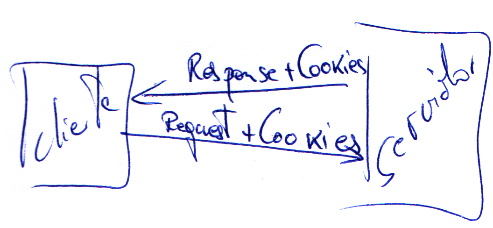
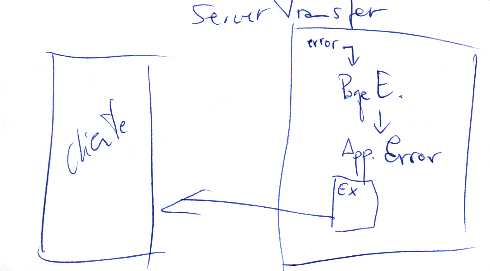

###Mecanismos o formas para guardar datos en cliente y en servidor.

Todo lo que se crea en el servidor termina perdiendose.

Hay dos sitios en los que podemos guardar el estado. El cliente y el servidor.

Cuando guardamos el estado en el *cliente*, significa que enviamos la información desde el servidor al cliente. Eso implica HTML o similar y eso limita a que el contenido sea *texto*.

Se podría mandar una *instancia* siempre que podamos *serializarla*

Cuando guardamos el estado en el *servidor*, podemos guardar información entre peticiones. Y al ser el servidor quien la guarda, podrá guardar *cualquier tipo que pueda manejar*. (Cadena, número, array, instancia, dataset, etc...)  

Cliente      | Servidor  
------------ | --------  
ViewState    | Estado de Sesión  
HiddenField  | Estado de Aplicación  
ControlState | Cache (no la típica)  
Cookies      |   
QueryString  |   

* **ViewState**.- Es un control en que el servidor *guarda el contenido de los controles* que usen ViewState (podemos decir a algunos que no lo usen) y que permitirá al cliente mantener los datos y al servidor *saber si ha habido cambios*.

    El control viewstate es un control **hiden** control con *información codificado no encriptado*.

    Para que un control no guarde su estado se cambia la propiedad **EnableViewState** = False. (por defecto viene en verdadero). Como el control está en el HTML hay que quitar la mayor información posible ya que *influye en el tráfico*.

    Tener en cuenta que el control de *viewstate* con la propiedad *EnableViewState* a false ya no tiene el valor de las cajas de texto donde se lo indiquemos, pero la propiedad de HTML **value** de la caja de texto tiene todavía el valor.

    En los controles editables se le suele poner la propiedad **EnableViewState** a true.  

    Si un control **HiddenField** le cambiamos la propiedad *Visible* a false, deja de verse en el HTML, la funcionalidad sigue porque está todavía en el *ViewState*.

* **ControlState.-** Lo gestiona automáticamente.

* **Cookies.-** Pequeños ficheros no suelen llegar a 1 kb. que se envían del servidor al cliente con información. *(no van en el HTML)*

* **QueryString.-** Son cadenas que se añaden a la petición de la página. Siempre son visibles. El truco para que no se vea es utilizar el **ServerTransfer** y de esa forma no se ve la línea de comandos web. *(no van en el HTML)*

###Cookies

Existen dos maneras de ver las cookies:

Por su **contenido** las simples y las compuestas.

* **Simple**.- la que guarda solo un contenido.
* **Compuesta**.- En luegar de tener un value será un diccionario, de 1 a n valores.  

Con respecto a su **duración**.

* **Temporales**.- Están en memoria del navegador y se pierden al cerrar este.
* **Permanentes**.- Se guardan en disco, la ubicación depende del navegador.

Toda cookie simple puede ser temporal o permanente y compuesta igual.

Se crea la *cookie* como objeto nuevo, pero para *mandarla* del servidor al cliente la añadimos al objeto *Response* con `Response.Cookies.Add(c);`

  

La **cookie compuesta** se crea sin valor y luego se añade los valores.

Para recuperarla referirnos a la *colección* **values** y seleccionamos el valor que queremos.

Al usar las cookies hay que tener cuidado con el Server.Transfer (va con una de retraso).  

Una cookie **NO** *se puede borrar en cliente *. La única forma de invalidarla es darle un valor inválido que yo reconozca por programación.

Para revisar si una variable es null o vacia se hace con `string.IsNullOrWhiteSpace`  

**Cookies permanentes**.

Técnicamente es lo mismo que una cookie temporal, pero se guardan en disco en el cliente.

Para convertir una cookie temporal en permanente hay que ponerle **fecha de caducidad**.

Una cookie sin fecha de caducidad caduca cuando se cierra el navegador.

Mientras que la cookie no caduque esta permanecerá en disco, si supera la fecha de caducidad el sistema entiende que ya no existe aunque esté grabada en disco.

El sistema solo la comprueba cuando va a mandarla al servidor.  
`        //Hago caducar la cookie es de tipo datetime`  
`        c.Expires = DateTime.Now.AddSeconds(30);`  
Tener cuidado que la cookie es legible y es texto, no mandar cosas raras.  
Podemos hacer que una cookie caduque.  
`        cp.Expires = DateTime.Now.AddYears(-1);`  

Si quiero modificar una cookie que tenga ya el cliente se la tengo que volver a mandar al cliente con el objeto **Response** `Response.Cookies.Add(cp);`  

###QueryString:
Una cadena que se añade a la barra de direcciones con información para procesar. Limitación de la longitud de la cadena en el navegador. Podría tener ciertas limitaciones, porque no todo se puede poner en ella. Van en texto plano, no hay codificación y encriptación.  
Como se escribe una querystring
dirección de la página.aspx?nombre=valor&  
Con **?** se separa la dirección de la página de los valores.  
Siempre son pares de **nombre = valor  **  
Si hay más valores se separan con **&**  
Caracteres prohibidos a la hora de usar el QueryString el caracter &.  
Esta es la petición que realiza el cliente. Esto no se guarda en ningún sitio, pero no se pierde porque está en la barra de direcciones.  
En la QueryString no se deben poner espacios.  
El objeto QueryString siempre existe aunque no tenga nada.  
Caracteres especiales, %, ?, =. Los espacios los sustituye por %20 que es el 32 en decimal.

El objeto Server tiene dos métodos para codificar contenido que va dentro del propio HTML. 
Métodos **HtmlEncode** y **HtmlDecode**.- Que transforma todos los caracteres especiales con significado en HTML en su HTML equivalente. Ejemplo: `<i>` en `&lt;i&gt;`  
Para la barra de direcciones los métodos del objeto **Server**, **UrlEncode** y **UrlDecode**.  

##Servidor
Hay tres maneras
* Estado de Sesión  
Puedo guardar en el diccionario de la sesión toda la información que quiera y el servidor la mantendrá mientras esté viva la sesión.
No sale del servidor y si se puede eleminar del servidor.  
Atentos que el contenido es de .NET por lo que puedes encontrar valores *(punteros)* a `null` 
Donde están aquí los problemas.  
Si cierro el brouser la sesión en el servidor no se cierra.  
Por defecto el sistema mantiene una sesión 20 mínutos. Si pasados los 20 minútos no ha habido ningúna interacción con el servidor, los datos de la sesión se pierde en el servidor. Cuidado con la información que guardamos por sesión, porque cada usuario que habre una página y se va a comer deja mucha información abierta en el servidor.  
¿ Que es una sesión ?  
Dentro de un navegador puede haber varias sesiones. En Internet Explorer opcion   

* Estado de Aplicación  
Permite mantener objetos en memoria comunes a todas las sesiones abiertas. El funcionamiento es básicamente igual que el de sesión, el de aplicación mantiene los datos mientras esté activa. El tiempo que se mantiene activa por defecto 20 mínutos después de la petición de cualquiera.  Se puede configurar en el IIS o en el Web.config  
La información en este área es común para todas las sesiones. Se suele usar para rellenar combos de provincias, días festivos.  
* Cache  
Es similar al objeto application, pero es nativo de .NET y permite muchas opciones. Mientras que application y sesión es algo Web se puede acceder a ellos desde ASP tradicional. Sin embargo el objeto cache es nuevo en .NET.
Es un diccionario de objetos como application pero tenemos un método add con muchas cosas y un método Insert que tiene 5 sobrecargas uno de ellos es el nombre y el valor, 2ª nombre, valor y CacheDependency una depende de otra cuando una cambie la otra es obsoleta, otro ejemplo, que dependa de un archivo ejemplo cadenas de conexión, si cambian el archivo cualquier cosa, caducan las variables. Estas dos dependencias puede ser de uno de de muchos. De muchos ficheros o de muchas variables.  
3ª sobrecarga, expiración absoluta o expiración relativa (a tal hora de tal día, o a las 12 horas).
4ª sobrecarga, CacheItemUpdateCallback (todo lo que termina con Callback son delegadas o punteros a funciones, especiales para la finalización de procesos/llamadas asíncronas). Utilizo esta función normalmente para recargar la variable.
5ª sobrecarga, se mantiene por compatibilidad, se le indica una prioridad (si el sistema necesita memoria una variable de cache el sistema puede eliminarla, con esta prioridad indicamos cual es más importante y no queremos que se borre y cual nos importa menos.)
6ª sobrecarga, CacheItenRemovedCallbak que esta si se usa cuando mandamos eliminar una variable de cache que función utiliza.

¿ Como controlamos cuando se inicia una sesión ?  
Existe un fichero **Global.asax** en .NET me va a vermitir poner todos los eventos generales de aplicación, sesión, e incluso página.  
El fichero no aparece por defecto hay que agregarlo. Clase de aplicación global, no cambiarle el nombre. Ya viene con una serie de eventos a nivel de aplicación y de sesión.    
* **Application_Start**.- Cuando se inicia la aplicación, de todos los que salen por defecto es el primero que se ejecuta.  
* **Application_End**.- Cuando se para la aplicación. Se debe recorrer el objeto application destruirlos  
* **Application_Error**.- código de error que se ejecuta un error no controlado. Si dentro de una pagina no ponemos el tratamiento de errores podemos crear un Page_Error, todo error de .NET no controlado, con **try catch** va a querer tratarse desde ese evento **Page_Error** de la página, llegado ha este punto la página es erronea, podría tratarla y mandar un **response.redirect**.  
Si no hay Page_Error, lo controlo desde Application_Error.  
Lo mismo, si lo soluciono debo redireccionarlo a una pantalla que me muestre los errores.  
**Server.GetLastError** es el método que te dá el error que te ha dado el error.  
**Server.ClearError** todos los errores deben ser limpiados, porque sino ese error de todas formas salta.  
Debemos utilizar una variable de sesión para pasar la información a la página de error. Variable que habría que limpiar para que no quede por ahí.  
Las propiedades de error **GetType** y **Message** nos dan información del error.  

Si uso el Page_Error de página no uso el Global.asax y al reves.  

En el Global no estoy ya en la página que ha producido el error y me envuelve la excepción en otra. Recuperamos el error en la excepción HttpUnhandledException en la propiedad InnerException. Con el método **GetBaseException** del objeto error buscamos la excepción de origen.  
`
        Session["Error"] = ex;

        //Llamo a la página de errores
        //Server.Transfer("PaginaErrores.aspx");
        
        //Si uso Response.Redirect en Application_Error SI necesito limpiar el error 
        // antes de terminar, porque si no el cliente recibe una redirección SIN Id de Sesión,
        //y pierde la variable de sesión porque empieza automáticamente otra sesión.
        Server.ClearError();
        //Llamo a la página de errores
        Response.Redirect ("PaginaErrores.aspx");`

Solo **se pierde la sesión** en el **ApplicationError** con **Response.Redirect**.  
Cuando hay un PageError no se genera el HTML de la página, o redirecciono o pongo un texto a capón Response.Write("ERROR de División por Cero !!!");  
Si hemos usado Server.ClearError ocurre eso sino como hay error ejecutaría el Application.Error  
En Application_Start creo la variable y en Session_Start incremento la variable.  
`
        //Para convertir un objeto a otro tipo uso el cast y el convert
        //Con Cast
        Application["Sesiones"] = (int)Application["Sesiones"] + 1;
        //Con Convert
        Application["Sesiones"] = Convert.ToInt32(Application["Sesiones"]) + 1;`

Las variables de **Sesión** se pueden guardar de tres maneras o en tres sitios. Según el valor de la propiedad **SessionState** del fichero **Web.config**  
* **InProc**.- Las variables las mantienen el mismo proceso que gestiona la aplicación en si misma. (Por defecto)  
* **StateServer**.- Que mantiene las variables de sesión en el mismo servidor Web (IIS), pero en un proceso independiente. Si tengo que tirar el proceso de la aplicación WEB se pierde la información de sesiones. En procesos independientes no se ven afectadas si paro el proceso de la aplicación para una actualización. No digo nada si se queda colgado el servidor Web (IIS).  
* **SQLServer**.- Permite guardar toda la información de sesiones en una base de datos de SQLServer con unas características especiales. Cuando utilizas membership. En el caso de usar granjas de servidores, se distribuye la carga, si las variables de sesión se guardan en memoria de un ordenador en la siguiente petición puede no caer en el mismo ordenador, por lo que se guardan en un servidor de base de datos común a los dos ordenadores. En esa granja de servidores *NO se pueden compartir las variables de Aplicación*.  
Si abandono sesión lo recomendable es mandar la aplicación a cualquier página de nuestra aplicación, si volviesemos a una página de la misma aplicación volvería a crear sesión. Y por eso en nuestro programa no funcionaba.  
Podemos bloquear todo el objeto application para que nadie lo modifique mientras realizo un proceso con el método Application.Lock() y cuando terminomeos llamaremos al método Application.UnLock();  

