Azure
=====

  Desarrollo para la plataforma Windows Azure con Visual Studio

Orden de los cursos
-------------------
* 10267 Web Basico  
* 10264 Web Avanzado
* 10263 WCF  
* 50466 Azure  

## MODULO: 10267A: Introducción al Desarrollo Web con Microsoft Visual Studio 2010. 32 horas de duración

### CONTENIDOS TEÓRICOS
--
#### MODULO 1: EXPLORACION DE MICROSOFT APLICACIONES WEB ASP.NET EN MICROSOFT VISUAL STUDIO 2010
* Introducción al Marco. NET
* Visión general de SAP.NET
* Visión general de la aplicación del laboratorio

#### MODULO 2: CREACIÓN DE APLICACIONES WEB. MEDIANTE MICROSOFT VISUAL ESTUDIO 2010 Y MICROSOFT NET.
* Elección de un lenguaje de programacion
* Descripcion general de Visual Studio 2010
* Creación de una aplicación web simple

***23/10/2013***  
Todas las aplicaciones WEB necesitan un servidor IIS.  

#####ASP
El fichero **.asp** tiene etiquetas de HTML  
Las etiquetas de tipo `<%-------%>` lo procesará el servidor.  
Al pedir una página al servidor IIS este realiza una copia del fichero para el usuario que las ha pedido.  
El servidor procesa todas las etiquetas `<%` y una vez que ha convertido a etiquetas estandar , el servidor manda el fichero, lo borra y no espera a ninguna respuesta por parte del cliente.  
Si quiero de nuevo la página el proceso se repetirá.  

#####.NET
El fichero **.aspx**, estas páginas normalmente llevan un fichero asociado con el mismo nombre de la página  
**.aspx.cs** en visual basic **.aspx.vb**  
El servidor manda el .aspx.cs al Framework, los resultados serán para los controles del .aspx  

`<asp:TextBox .......`  


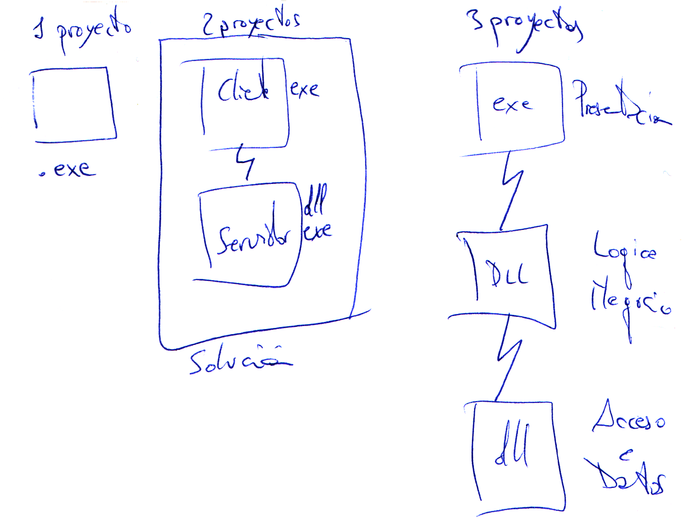
Cada vez que compilamos un proyecto crea un **Ensamblado**  

#####Solución
Conjunto de proyectos destinados a solucionar un problema.  

Siempre se va a crear una solución para trabajar con Visual Studio.  
**Ficheros:**  
**.sln** información de los proyectos que tiene que cargar Visual Studio y en que orden  
**.suo**  

Jerarquicamente de la solución cuelgan los diferentes proyectos, puede ir en diferentes directorios o no según seleccionemos.  

Por cada proyecto creará un fichero **.csproj**  
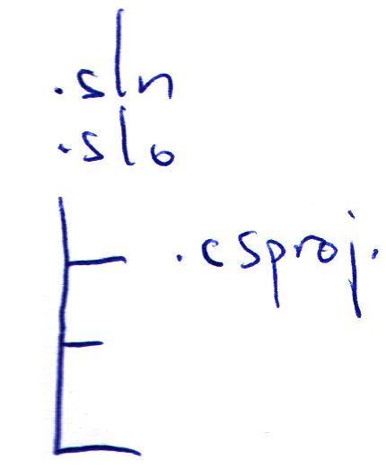

#####Proyectos Web
Un proyecto en el cual vamos a tener el fichero **.csproj, .aspx y .aspx.cs, web.config, etc...**  
Esto va a crear una DLL con todo el contenido del proyecto y todos los ficheros aspx, web.config y otros que no se compilan.  

#####Sitio Web
No hay fichero de proyecto, no va a haber ninguna DLL compilada y por defecto todo lo que está en el directorio forma parte del sitio web.  
Tienen una caracteristica mas, están pensadas para una aplicación más pequeña y **NO tienen espacio de nombres**.  

#####Nota:
Todo proyecto al compilarse va en la misma DLL, obliga a que esté todo en el mismo lenguaje.  
En los sitios web se puede mezclar la programación de diferentes lenguajes. Basicamente porque no se crea DLL, aunque existe una compilación temporal, cada pagina es una DLL en lenguaje **IL** que se recompila a binario sin distinguir ya VB o C#.  
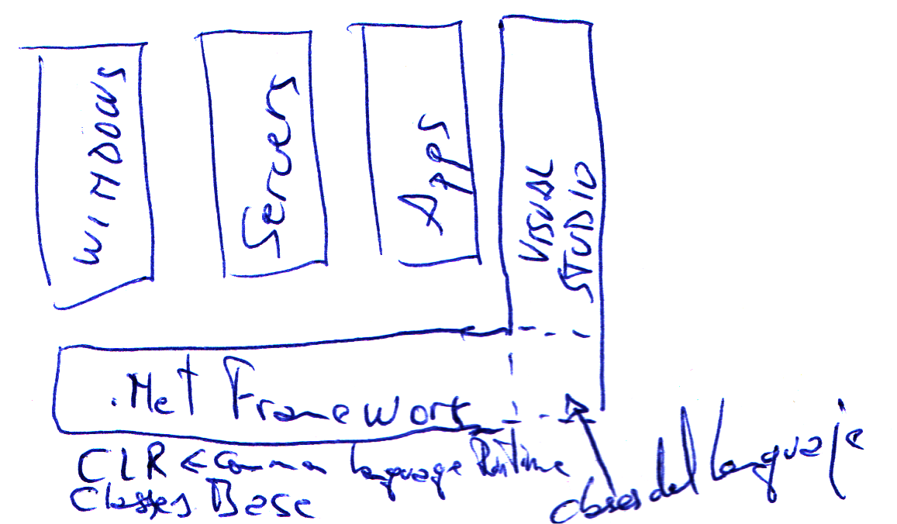  

Visual Studio al ejecutar un Sitio Web abre la página que estés editando.  
Si queremos que una *página sea la inicial* en el explorador de soluciones, sobre la página que queramos *botón derecho/establecer como página principal*.  
Si queremos cambiar más cosas, sobre solución boton derecho Pagina de propiedades y están todas las opciones, en Opciones de inicio están las diferentes opciones posibles.  

Que ocurre cuando pulso F5 en Visual Studio,  
El código fuente se precompila en IL automáticamente se recompila y es cuando en memoria se crea el binario.  
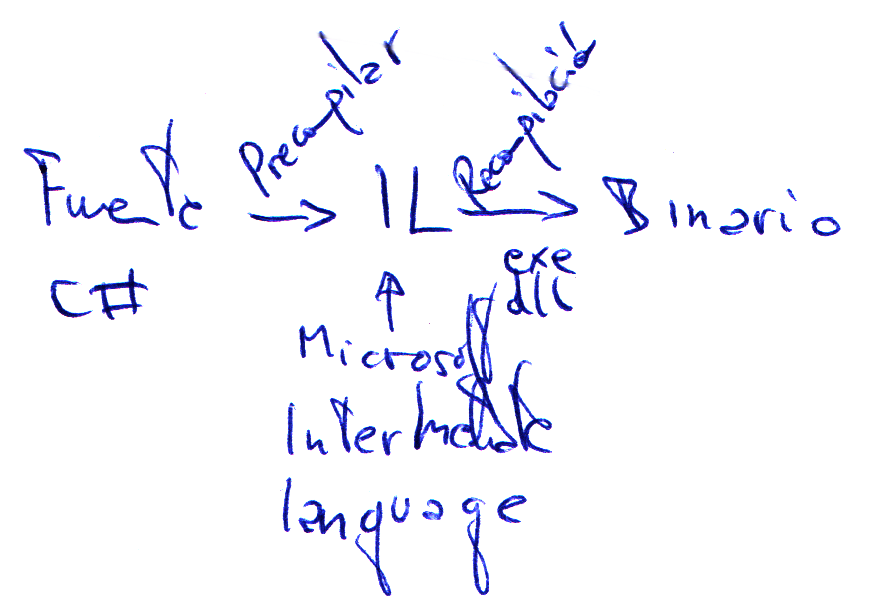

#####Explicacion del HTML
`<%@ Page Language="C#" AutoEventWireup="true" CodeFile="Default.aspx.cs" Inherits="_Default" %>`  

**Page** indica que es una página web  
**Language** es el lenguaje de programación en que está creado el código.  
**Codefile** En que fichero físico está la clase de esta página.  
**Inherits** Es el nombre de la clase.  
Esto funciona porque la clase está definida como **partial**.  

Existe un formato donde podemos incluir **todo en un fichero**.  
Se crea con un pinchito al crear el nuevo elemento para el sitio web.  
El cliente no recibe el código que se genera en la cabecera del fichero .aspx.  
**\<head\>** Cabecera del fichero HTML  
**\<title\>** Título de la página.  
**\<body\>** todo lo visible.  
> **\<form\>** en .NET solo puede haber un form que se ejecute en el servidor.  
**\<div\>**  

En .NET por defecto cualquier control que haga que mi pagina se envie al servidor para cualquier cosa hace que el servidor reciba esa página y que por defecto devuelva **la misma página** reprocesada.  
No hay que especificar el action en la etiqueta form porque no funciona así. El lo reconvierte automáticamente.  

#####Comentar líneas en ASPX
**\<%--     --%\>** ***No*** lo recibe el cliente en el HTML  
**\<!--     --\>**  ***Si*** lo recibe el cliente en el HTML  

#####Scripting en el cliente
Javascript que se ejecutará en el cliente sin necesidad de mandar la página al servidor hasta que es necesario.  
C# siempre se ejecutará en el servidor.  

Por defecto todos *los controles de .net guardan o mantienen el estado* es decir el valor entre peticiones.  
Los de HTML no guardan el valor entre peticiones, este comportamiento es por defecto, pero se puede cambiar en los dos.  

La etiqueta **runat="server"** permite que vea el objeto en el servidor, en este caso el valor se guarda entre peticiones, además que añade el parametro name a la etiqueta.  

***24/10/2013***    
#####Controles
* Los **CheckBox** no tienen el valor null, si no se ha rellenado el texto del checkbox nos aparece entre corchetes el nombre del control.  
* **CheckListBox** lista de checkboses.  
* **DropDownList** combobox de toda la vida, solo se puede poner texto.  
En algunos controles en la vista de visualización aparece un icono que permite cambiar configuración.  
* **FileUpload** Seleciona un fichero en un directorio del cliente. (No lo manda al servidor, se debe hacer con javascript).  
* **HiddenField** Control oculto tipico uso guardar variables.  
* **HyperLink** Hiper enlace.  
* **Image** Una imagen.  
* **ImageButton** Botón con una imagen.  
* **ImageMap** División de una imagen en regiones, y se puede pulsar una region completa.  
* **Lavel** Un texto, tiene propiedades (color, tipo de letra, y pocas más)  
* **LinkButton** Es un botón con aspecto de hipervínculo.  
* **ListBox** Solo textos, lista de testos que se pueden seleccionar.  
* **Literal** Uno de los dos únicos controles que *no añade HTML*. Tiene propiedades, pero casi nada, ni color ni fuente. Pero se puede utilizar en programación puedo calificar el texto con tag's \<b\>'  
* **Localice** utilización en cuestiones de idioma.  
* **Multiview** Es un contenedor de **Views** o visualiza 1 o ninguna.  
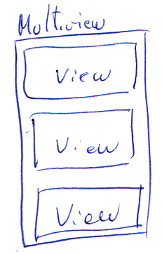
* **Panel** Es un contenedor que se convierte en un **\<div\>**  
* **PlaceHolder** Es el otro control que *no genera HTML*. Se suele poner para en tiempo de ejecución añadir cosas. En diseño es muy pesado de manejar. (Páginas maestras).  
* **RadioButton** Tipico RadioButton. No son excluyentes entre ello. Deben estar metidos en un grupo. Todos los que tengan el mismo groupname son escluyentes entre ellos.  
* **RadioButtonList** Grupo de RadioButton.  
* **Substitution** No se utiliza. Está relacionado con la cache.  
* **Tabla** Es la misma tabla que la de HTML, es más como de trabajar en VS y se pruede utilizar en C#.  
* **TextBox** Caja de texto.  
* **Wizard** Algo parecido al Multiview pero va por pasos, tiene las pestañitas, el siguiente, anterior, etc...  
* **Xml** Permite formatear un fichero XML y transformarlo en HTML. Usando un fichero de transformación **.xslt**. Este fichero da la estructura para transformar el xml en un formato distinto, html, csv, otro xml con estructura cambiada, etc...  

####Maneras de pasar de una página a otra.
El control hiperlink encargado de cambiar de páginas.  
Utilizamos las propiedades **ImageUrl** para indicarle una imagen o **NavigateUrl** para indicarle la página. El signo **\~** indica que el objeto está colgando de la raíz del sitio.  
El **HiperLink** tiene una propiedad llamada **Target** me permite identificar donde se va a abrir ese hipervinculo. Esto es de cuando se utilizaban FRAMES. La opción _blanck nos habre una ventana nueva. (_parent, _search, _self o nada en la misma ventana, _top marco superior)  
En los **LinkButton** tiene una propiedad **PostBackUrl** permite especificar la dirección a la que queremos ir. Tiene evento **Click** y pocos más, porque se ejecutan en el **servidor**. Inconveniente este control *NO tiene la propiedad* **Target** por lo que se abre siempre en la misma ventana.  

Pregunta de examen métodos para mandar a otra página, **PostBackUrl**, en **OnClick** puedes usar **Server.Transfer** o **Response.Redirect**. Con Click puedo cargar un combobox, cambiar cajas de texto, mientras que con el PostBackUrl solo se ejecuta el **Load** de la página.

La diferencia entre *HiperLink* y *ButtonLink*, es que el *Button* ejecuta *JavaScript* para llegar a la página, pero la forma de llamarla es diferente. El *Botón* actua como si ya estubiesemos en una pagina que ya está cargada metodo **POST**.  

####Sesión:
Es la forma que tiene el servidor de hacer el seguimiento de las peticiones de un peticionario para devolver correctamente las páginas solicitadas. Que no estamos hablando de la sesión de seguridad de una página de un banco.  
La primera petición de un cliente a un servidor **SesionId** vacío, el servidor responde con la página con una cabecera con SessionId con un número. La primera petición es de tipo **GET** a partir de este momento las peticiones son de tipo **POST** con SessionId con el número que devolvió el servidor.  
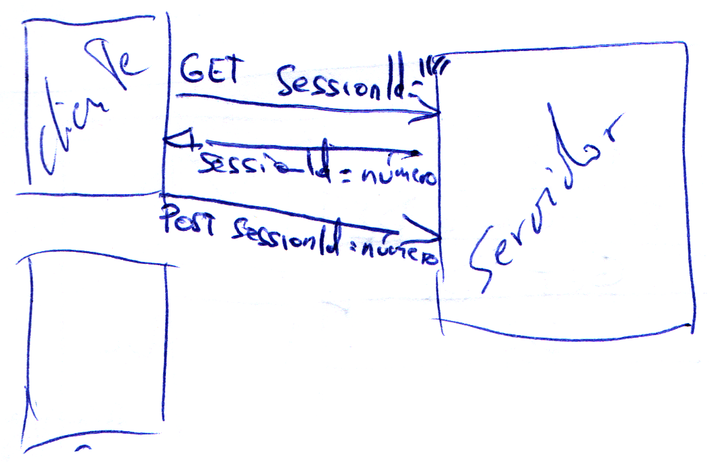

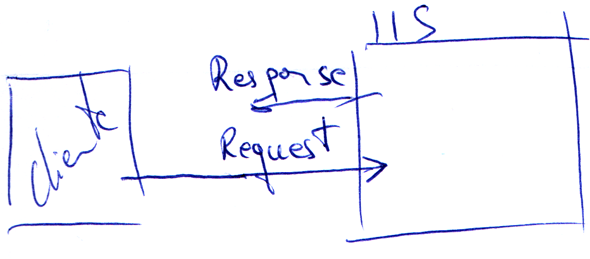
**Server.Transfer:**  
**Server** es el objeto servidor, me dá información del servidor.  
El método **Transfer** solicita la página a la que quiere ir.  
No permite poner como página una que no pertenezca al servidor. Google fallaría.  
Basicamente le estoy diciendo al servidor. **No sigas procesando esta página y procesa la que te he pedido.**  
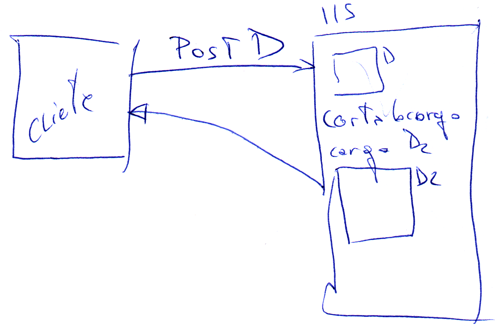
En el Server.Transfer **la página no va a salir en la linea de direcciones**. Evitamos que el cliente pueda ver el nombre y dirección de la página que realmente le estamos enseñando. Impide poder crear un acceso directo a una página.  

**Response.Redirect** (si podemos acceder a páginas externas)  
El objeto `Response` contiene información del servidor al cliente.  
El objeto `Request` contiene la información enviada del cliente al servidor.  
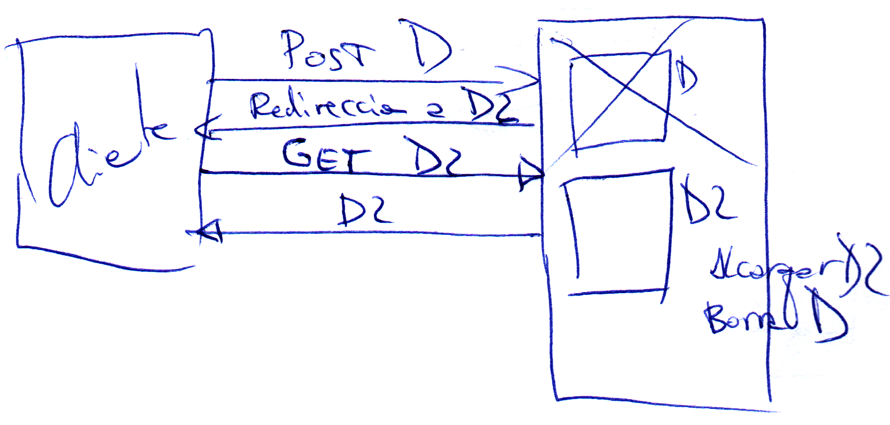

En ambos casos hemos obtenido la página, si lo vemos en google con response si funciona.  
`<asp:Button ID="Button2" runat="server" Text="Server.Transfer" onclick="Button2_Click" />`
Con la palabra `onclick` indicamos la función de C# que se va a ejecutar esa función.  

Las páginas pueden ser una **primera carga** o una **recarga**. Cuando mandamos algo al servidor mandamos un **Postback**  
La propiedad [^1]**IsPostback** es la que me determina si es primera carga o es recarga.  
[^1]: Posible pregunta de examen.  

Si no es PostBack debo cargar los datos de un combobox (por ejemplo).  
Existe una propiedad **PreviusPage** es la página anterior. Es un puntero a la página anterior si la hay sino estará a **NULL** en **C#** o **NOTHING** en **VB**.  

***25/10/2013***  
####Página maestra:
Es una página especial que define una plantilla de visualización. Estará compuesta por todos los controles que queramos más **al menos dos contenedores especiales**. Esos dos contenedores seran donde se coloque todo lo que tengan las páginas que usa la página maestra.  
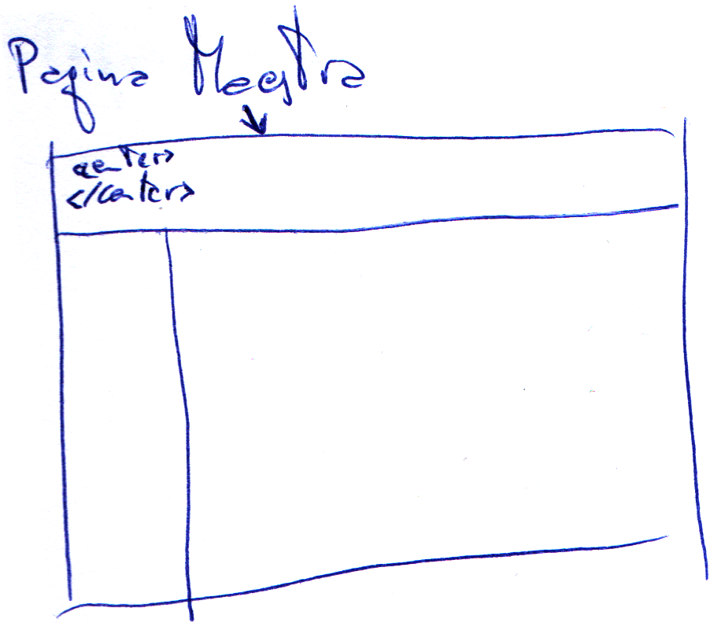  
Uno en el **head** (no visible) y otro en el **body** (visible), en este contenedor no **puedo poner nada**. Y en la página de inicio solo puedo poner dato en este contenedor.  
Vamos a crear una página maestra.  
El nombre del fichero tiene extensión **.master**  
Las paginas maestras y las páginas que usan esa página maestra tienen que **coincidir en número de contenedores y nombre**.  
Poner los contenedores al principio o luego tendremos que cambiar todas las páginas que usen esa pagina maestra.  
El programa fusiona la hoja maestra con la que tengamos en nuestra página. El usuario no sabrá diferenciar lo que es de la página maestra de lo que no.  
Pueden tener lo que nos de la gana, siempre que pongamos el contenedor `<asp:ContentPlaceHolder id="ContentPlaceHolder1" runat="server">`.  
cada contenedor está incluido en un `<div>`.  
Para crear un formulario dependiente de la página maestra debemos marcar la opción 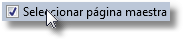
La página creada solo tienen dos contenedores que son los que tenía la pagina maestra. La información solo podemos ponerla dentro de ellos.  

###Proyectos WEB
Para crear proyectos *NO nos da opción de crearlo en un servidor IIS*, luego tu ya lo subes cuando quieras. Se crea siempre en un directorio fisico.  
Hay **tres web.config** un *Debug* un *Release* y según compiles de una manera o de otra puedes tener por ejemplo diferente base de datos según sea debug o release.  
En el directorio **bin** estará la DLL.  
Ya *NO tengo opción de cambiar de lenguaje*, si la solución es C# ya no se cambia.  
####**Diferencias de la página maestra de un proyecto web y un sitio web.**  
####Proyecto WEB
```<%@ Master Language="C#" AutoEventWireup="true" CodeBehind="Site1.master.cs"  
     Inherits="ProyectoHolaMundo.Site1" %>```  
`CodeBehind` aquí  
`Inherits="ProyectoHolaMundo.Site1"` lleva espacio de nombres  
####Sitio WEB  
```<%@ Master Language="C#" AutoEventWireup="true" CodeFile="MasterPage.master.cs"  
     Inherits="MasterPage" %>```  
`CodeFile` aqui  
`Inherits="MasterPage"` nombre de la página.  
En la página de inicio también existen estas mismas diferencias  
```<%@ Page Title="" Language="C#" MasterPageFile="~/Site1.Master" AutoEventWireup="true"  
     CodeBehind="Inicio.aspx.cs" Inherits="ProyectoHolaMundo.Inicio" %>```  

###Terminado Proyectos WEB


```<%@ Page Language="C#" AutoEventWireup="true" CodeFile="Default.aspx.cs"  
     Inherits="_Default" %>```  
**AutoEventWireup** puesto a true significa que los *eventos* de página se *auto asignan* si cumplen con la *nomenclatura estandar*.  
###ViewState
Es un control en que el servidor *guarda el contenido de los controles* que usen ViewState (podemos decir a algunos que no lo usen) y que permitirá al cliente mantener los datos y al servidor *saber si ha habido cambios*.  
El control viewstate es un control **hiden** control con *información codificado no encriptado*.  
Para que un control no guarde su estado se cambia la propiedad **EnableViewState** = False. (por defecto viene en verdadero)  
Como el control está en el HTML hay que quitar la mayor información posible ya que *influye en el tráfico*.  
Tener en cuenta que el control de viewstate no tiene el valor de las cajas de texto que indiquemos, pero la propiedad value de la caja de texto tiene todavía el valor.  
Toda página web cuando se pide a un servidor se producen un grupo de eventos.  
Existen tres bloques de evento
* **Eventos de carga**  
Preinicializacion, inicializacion, carga. `Load`  
* **Eventos de cambio (0-n)**  tantos como cambios en cajas de texto, comboboxex, etc.. que haya habido. **NO se garantiza el orden de ejecución**, no programar en relación a otro cambio.  
Todos los eventos que se producen porque los controles han cambiado su valor. Pueden producirse de 0 a n.
* **Evento de acción (0-1)**  
Es el que fuerza que la página vaya al servidor.  
Hay controles que obligan eventos de acción ejemplo un botón.  
Hay controles que no forzarán nunca la acción al servidor.  
Otros como programador decides si van o no al servidor, ejemplo un combo, un listbox, etc...  
En los controles editables se le suele poner la propiedad **EnableViewState** a true.  
La propiedad **IsPostBack** de la pagina nos indica si es una *recarga* o se carga por *primera vez*.  
Si un control **HiddenField** le cambiamos la propiedad *Visible* a false, deja de verse en el HTML, la funcionalidad sigue porque está todavía en el *ViewState*.  

Todo lo que se crea en el servidor termina perdiendose.  
Hay dos sitios en los que podemos guardar el estado. El cliente y el servidor.  
Cuando guardamos el estado en el *cliente*, significa que enviamos la información desde el servidor al cliente. Eso implica HTML o similar y eso limita a que el contenido sea *texto*.  
Se podría mandar una *instancia* siempre que podamos *serializarla*  
Cuando guardamos el estado en el *servidor*, podemos guardar información entre peticiones. Y al ser el servidor quien la guarda, podrá guardar *cualquier tipo que pueda manejar*. (Cadena, número, array, instancia, dataset, etc...)  

###Mecanismos o formas para guardar datos en cliente y en servidor.
Cliente      | Servidor
------------ | --------
ViewState    | Estado de Sesión
HiddenField  | Estado de Aplicación
ControlState | Cache (no la típica)
Cookies      | 
QueryString  | 

**ControlState.-** Lo gestiona automáticamente  
**Cookies.-** Pequeños ficheros no suelen llegar a 1 kb. que se envían del servidor al cliente con información.  
**QueryString.-** Son cadenas que se añaden a la petición de la página. Siempre son visibles. El truco para que no se vea es utilizar el **ServerTransfer** y de esa forma no se ve la línea de comandos web.  
Cookies y querystring no van en el HTML  

Existen dos maneras de ver las cookies:

Por su **contenido** las simples y las compuestas.  
* Simple.- la que guarda solo un contenido.
* Compuesta.- En luegar de tener un value será un diccionario, de 1 a n valores.  

Con respecto a su **duración**.  
* Temporales.- Están en memoria del navegador y se pierden al cerrar este.
* Permanentes.- Se guardan en disco, la ubicación depende del navegador.

Toda cookie simple puede ser temporal o permanente y compuesta igual.  
Se crea la *cookie* como nuevo objeto, pero para *mandarla* del servidor al cliente la añadimos al objeto *Response* con `Response.Cookies.Add(c);`  
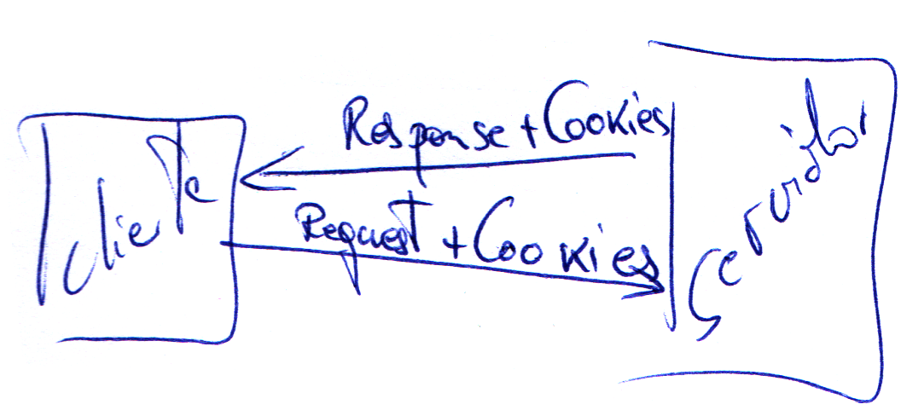  
La cookie compuesta se crea sin valor y luego se añade.  
Para recuperarla referirnos a la colección values y seleccionamos el valor que queremos.  
Al usar las cookies hay que tener cuidado con el Server.Transfer (va con una de retraso).  

Una cookie no se puede borrar en cliente. La única forma de invalidarla es darle un valor inválido que yo reconozca por programación.  
Para revisar si una variable es null o vacia se hace con `string.IsNullOrWhiteSpace`  

###Cookies permanentes.  
Técnicamente es lo mismo que una cookie temporal, pero se guardan en disco en el cliente.  
Para convertir una cookie temporal en permanente hay que ponerle fecha de caducidad.  
Una cookie sin fecha de caducidad caduca cuando se cierra el navegador.  
Mientras que la cookie no caduque esta permanecerá en disco, si supera la fecha de caducidad el sistema entiende que ya no existe aunque esté grabada en disco.
El sistema solo la comprueba cuando va a mandarla al servidor.  
`        //Hago caducar la cookie es de tipo datetime`  
`        c.Expires = DateTime.Now.AddSeconds(30);`  
Tener cuidado que la cookie es legible y es texto, no mandar cosas raras.  
Podemos hacer que una cookie caduque.  
`        cp.Expires = DateTime.Now.AddYears(-1);`  

Si quiero modificar una cookie que tenga ya el cliente se la tengo que volver a mandar al cliente con el objeto **Response** `Response.Cookies.Add(cp);`  

###QueryString:
Una cadena que se añade a la barra de direcciones con información para procesar. Limitación de la longitud de la cadena en el navegador. Podría tener ciertas limitaciones, porque no todo se puede poner en ella. Van en texto plano, no hay codificación y encriptación.  
Como se escribe una querystring
dirección de la página.aspx?nombre=valor&  
Con **?** se separa la dirección de la página de los valores.  
Siempre son pares de **nombre = valor  **  
Si hay más valores se separan con **&**  
Caracteres prohibidos a la hora de usar el QueryString el caracter &.  
Esta es la petición que realiza el cliente. Esto no se guarda en ningún sitio, pero no se pierde porque está en la barra de direcciones.  
En la QueryString no se deben poner espacios.  
El objeto QueryString siempre existe aunque no tenga nada.  
Caracteres especiales, %, ?, =. Los espacios los sustituye por %20 que es el 32 en decimal.

El objeto Server tiene dos métodos para codificar contenido que va dentro del propio HTML. 
Métodos **HtmlEncode** y **HtmlDecode**.- Que transforma todos los caracteres especiales con significado en HTML en su HTML equivalente. Ejemplo: `<i>` en `&lt;i&gt;`  
Para la barra de direcciones los métodos del objeto **Server**, **UrlEncode** y **UrlDecode**.  

##Servidor
Hay tres maneras
* Estado de Sesión  
Puedo guardar en el diccionario de la sesión toda la información que quiera y el servidor la mantendrá mientras esté viva la sesión.
No sale del servidor y si se puede eleminar del servidor.  
Atentos que el contenido es de .NET por lo que puedes encontrar valores *(punteros)* a `null` 
Donde están aquí los problemas.  
Si cierro el brouser la sesión en el servidor no se cierra.  
Por defecto el sistema mantiene una sesión 20 mínutos. Si pasados los 20 minútos no ha habido ningúna interacción con el servidor, los datos de la sesión se pierde en el servidor. Cuidado con la información que guardamos por sesión, porque cada usuario que habre una página y se va a comer deja mucha información abierta en el servidor.  
¿ Que es una sesión ?  
Dentro de un navegador puede haber varias sesiones. En Internet Explorer opcion 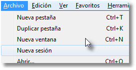  

* Estado de Aplicación  
Permite mantener objetos en memoria comunes a todas las sesiones abiertas. El funcionamiento es básicamente igual que el de sesión, el de aplicación mantiene los datos mientras esté activa. El tiempo que se mantiene activa por defecto 20 mínutos después de la petición de cualquiera.  Se puede configurar en el IIS o en el Web.config  
La información en este área es común para todas las sesiones. Se suele usar para rellenar combos de provincias, días festivos.  
* Cache  
Es similar al objeto application, pero es nativo de .NET y permite muchas opciones. Mientras que application y sesión es algo Web se puede acceder a ellos desde ASP tradicional. Sin embargo el objeto cache es nuevo en .NET.
Es un diccionario de objetos como application pero tenemos un método add con muchas cosas y un método Insert que tiene 5 sobrecargas uno de ellos es el nombre y el valor, 2ª nombre, valor y CacheDependency una depende de otra cuando una cambie la otra es obsoleta, otro ejemplo, que dependa de un archivo ejemplo cadenas de conexión, si cambian el archivo cualquier cosa, caducan las variables. Estas dos dependencias puede ser de uno de de muchos. De muchos ficheros o de muchas variables.  
3ª sobrecarga, expiración absoluta o expiración relativa (a tal hora de tal día, o a las 12 horas).
4ª sobrecarga, CacheItemUpdateCallback (todo lo que termina con Callback son delegadas o punteros a funciones, especiales para la finalización de procesos/llamadas asíncronas). Utilizo esta función normalmente para recargar la variable.
5ª sobrecarga, se mantiene por compatibilidad, se le indica una prioridad (si el sistema necesita memoria una variable de cache el sistema puede eliminarla, con esta prioridad indicamos cual es más importante y no queremos que se borre y cual nos importa menos.)
6ª sobrecarga, CacheItenRemovedCallbak que esta si se usa cuando mandamos eliminar una variable de cache que función utiliza.

¿ Como controlamos cuando se inicia una sesión ?  
Existe un fichero **Global.asax** en .NET me va a vermitir poner todos los eventos generales de aplicación, sesión, e incluso página.  
El fichero no aparece por defecto hay que agregarlo. Clase de aplicación global, no cambiarle el nombre. Ya viene con una serie de eventos a nivel de aplicación y de sesión.    
* **Application_Start**.- Cuando se inicia la aplicación, de todos los que salen por defecto es el primero que se ejecuta.  
* **Application_End**.- Cuando se para la aplicación. Se debe recorrer el objeto application destruirlos  
* **Application_Error**.- código de error que se ejecuta un error no controlado. Si dentro de una pagina no ponemos el tratamiento de errores podemos crear un Page_Error, todo error de .NET no controlado, con **try catch** va a querer tratarse desde ese evento **Page_Error** de la página, llegado ha este punto la página es erronea, podría tratarla y mandar un **response.redirect**.  
Si no hay Page_Error, lo controlo desde Application_Error.  
Lo mismo, si lo soluciono debo redireccionarlo a una pantalla que me muestre los errores.  
**Server.GetLastError** es el método que te dá el error que te ha dado el error.  
**Server.ClearError** todos los errores deben ser limpiados, porque sino ese error de todas formas salta.  
Debemos utilizar una variable de sesión para pasar la información a la página de error. Variable que habría que limpiar para que no quede por ahí.  
Las propiedades de error **GetType** y **Message** nos dan información del error.  

Si uso el Page_Error de página no uso el Global.asax y al reves.  
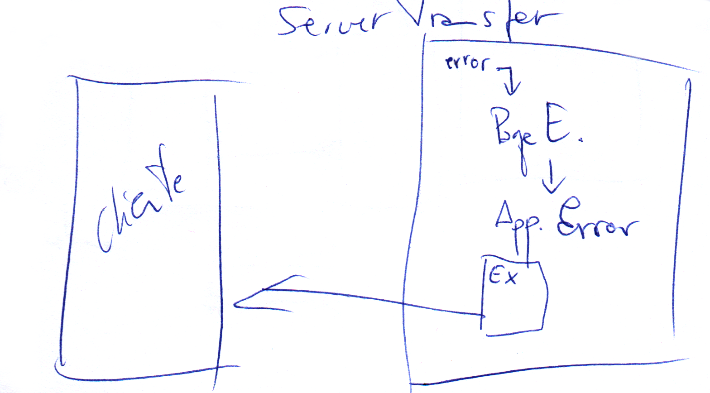
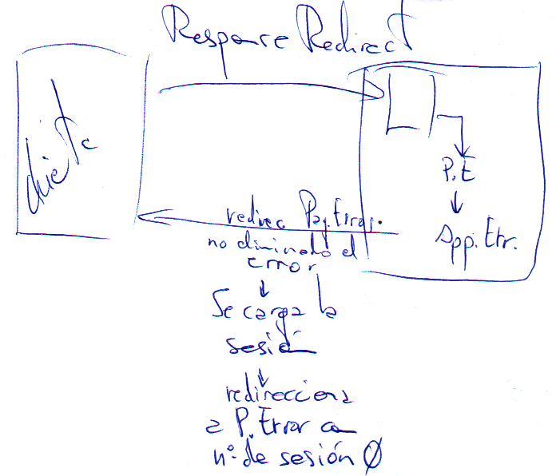
En el Global no estoy ya en la página que ha producido el error y me envuelve la excepción en otra. Recuperamos el error en la excepción HttpUnhandledException en la propiedad InnerException. Con el método **GetBaseException** del objeto error buscamos la excepción de origen.  
`
        Session["Error"] = ex;

        //Llamo a la página de errores
        //Server.Transfer("PaginaErrores.aspx");
        
        //Si uso Response.Redirect en Application_Error SI necesito limpiar el error 
        // antes de terminar, porque si no el cliente recibe una redirección SIN Id de Sesión,
        //y pierde la variable de sesión porque empieza automáticamente otra sesión.
        Server.ClearError();
        //Llamo a la página de errores
        Response.Redirect ("PaginaErrores.aspx");`

Solo **se pierde la sesión** en el **ApplicationError** con **Response.Redirect**.  
Cuando hay un PageError no se genera el HTML de la página, o redirecciono o pongo un texto a capón Response.Write("ERROR de División por Cero !!!");  
Si hemos usado Server.ClearError ocurre eso sino como hay error ejecutaría el Application.Error  
En Application_Start creo la variable y en Session_Start incremento la variable.  
`
        //Para convertir un objeto a otro tipo uso el cast y el convert
        //Con Cast
        Application["Sesiones"] = (int)Application["Sesiones"] + 1;
        //Con Convert
        Application["Sesiones"] = Convert.ToInt32(Application["Sesiones"]) + 1;`


Las variables de **Sesión** se pueden guardar de tres maneras o en tres sitios. Según el valor de la propiedad **SessionState** del fichero **Web.config**  
* **InProc**.- Las variables las mantienen el mismo proceso que gestiona la aplicación en si misma. (Por defecto)  
* **StateServer**.- Que mantiene las variables de sesión en el mismo servidor Web (IIS), pero en un proceso independiente. Si tengo que tirar el proceso de la aplicación WEB se pierde la información de sesiones. En procesos independientes no se ven afectadas si paro el proceso de la aplicación para una actualización. No digo nada si se queda colgado el servidor Web (IIS).  
* **SQLServer**.- Permite guardar toda la información de sesiones en una base de datos de SQLServer con unas características especiales. Cuando utilizas membership. En el caso de usar granjas de servidores, se distribuye la carga, si las variables de sesión se guardan en memoria de un ordenador en la siguiente petición puede no caer en el mismo ordenador, por lo que se guardan en un servidor de base de datos común a los dos ordenadores. En esa granja de servidores *NO se pueden compartir las variables de Aplicación*.  
Si abandono sesión lo recomendable es mandar la aplicación a cualquier página de nuestra aplicación, si volviesemos a una página de la misma aplicación volvería a crear sesión. Y por eso en nuestro programa no funcionaba.  
Podemos bloquear todo el objeto application para que nadie lo modifique mientras realizo un proceso con el método Application.Lock() y cuando terminomeos llamaremos al método Application.UnLock();  

##Controles de validación
Son controles que van a permitir validar la entrada de datos de usuario, normalmente en cliente, dando la posibilidad de algunos de ellos validar en ambos sitios (Cliente/Servidor). El sistema crea normalmente código de javascript para realizar esta validación en cliente, aunque a veces no veremos este código por encontrarse en ficheros aparte con extensión **.js** que son librerías.  
Se ejecutaría el código y hay un error el control te muestra el error y no manda la página al servidor.  
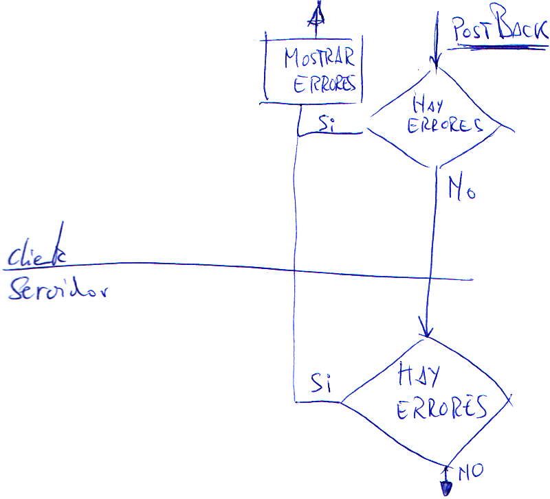  
Todas tienen propiedades comunes. Las tres propiedades que siempre tendremos que tener en cuenta son:  
* **ControlToValidate** me permite establecer que control de usuario quiero validar con este control.
* **Text**.- Texto que mostrará el control cuando haya error. Si dejo este en blanco cogería el de **ErrorMessage**.
* **ErrorMessage**.- Texto que se mostrará en el control de validación **ValidatiónSumary** si lo ponemos.
* **Display**.- **Static** el espacio se reserva se vea o no el control, **Dynamic** el espacio no se reserva y **None** el error no se ve.
###Controles de Validación:  
* **RequiredFieldValidator**.- Este control valida que haya dato o no en una caja de texto. Si hay dato el control valida correctamente, si no hay dato mostará los errores. Hay controles que validan cuando pierde el foco la caja de texto.
* **CompareValidator**.- Permite comparar el contenido de un control o bien contra otro control o bien contra un valor. Otras dos propiedades que tienen que ver con lo que queremos comparar, **ControlToCompare** control contra el que vamos a comparar, **ValueToCompare** para establecer el valor contra el que vamos a validar. En la propiedad **Operator** indicamos mayor, mayor igual, menor, menor igual, igual, distinto, chequear el tipo de dato. La propiedad **Type** debemos indicarle el tipo (string, integer, doble, date, currency). No comparan si el control está vacío CustomValidator si controla el vacío.
* **RegularExpressionValidator**.- No comparan si el control está vacío CustomValidator si controla el vacío.
* **RangeValidator**.- No comparan si el control está vacío CustomValidator si controla el vacío. Permite validar que el dato está dentro de un rango. Propiedades **MinimumValue**, **MaximumValue** y **Type**.
* **RegularExpressionValidator**.- Valida utilizando una expresión regular. Las expresiones regulares son cadenas (strings) que definen un formato o plantilla.  
Ejemplo:  
código postal
\d{5} escape \\ d - dígito entre llaves el número de caracteres.  
Dirección de correo electrónico.  
\w+([-+.']\w+)*@\w+([-.]\w+)*\.\w+([-.]\w+)*  '
letras mínimo una (de 0 a n de un - o in + o un .) una @ caracteres de 1 a n veces (de 0 a n veces o - o . al menos una letra) un . de una a n letras (de 0 a n veces o - o . al menos una letra)  
Direción web  
http(s)?://([\w-]+\.)+[\w-]+(/[\w- ./?%&=]*)?  
http una s o nada ://(una o mas veces una letra o un guión un punto) una letra o un guión una o mas veces una /
**\?** 1 o ninguna  
**\*** 0 a n veces  
**\+** 1 a n veces  
Web con una base de datos de expresiones regulares http://regexlib.com/DisplayPatterns.aspx  
* **CustomValidator**.- Como su nombre indica el customvalidator permite validar a gusto del consumidor. Yo voy a escribir la validación que voy a hacer. Este control igual que os otros tiene la propiedad EnableClientScript. Este cliente puede validad en cliente y en servidor cosas diferentes, si queremos validar en cliente tendremos que escribir una función de script para validar y si queremos validar en servidor usaremos el evento **ServerValidate**. Este control tiene un evento más que los demás controles **ServerValidate**. Primero valida en cliente y luego valida en servidor.

Todos estos controles validan en el cliente pero algunos puede validar tambien en servidor, por ejemplo en un rangevalidator los valores máximo y mínimo quiero que sea en base a otro dato que me haya dado en el formulario o que el servidor lo indique, tengo que hacer que el control vaya al servidor. Con la propiedad **EnambleClientScript** que por defecto el control valida en cliente si está puesta a true, cuando la ponemos a false no valida en cliente y pasa a validar en servidor.  
Si se valida en el servidor debemos hacer algo para que si hay un error en la validación no le permitamos que vaya a la página que le hemos indicado y que nos presente la pagina de nuevo con los errores. La variable Page.IsValid es false algún control de validación ha dicho que la página no es correcta, ya en el servidor.   

Un control de validación solo puede validar a un control.

En el evento del servidor el parámetro args es un objeto y tiene varias propiedades y metodos, uso normalmente **args.value**. Para devolver la validación correcta o incorrecta lo hacemos con la propiedad **args.IsValid = false**.    
ValidateEmptyText="True" comprueba la validación de cliente y de servidor aunque la caja esté vacía. Si lo ponemos a false no comprueba la caja vacía ni en cliente ni en el servidor.  
**Orden de los eventos de página:**  
* Load
* Eventos de Cambio
* Eventos de validación
* Eventos de Acción

Existen script que se ejecutan en cualquier momento de la página,  en el PostBack de la página y script de función que yo las llamo cuando quiero.  
Los de función se tienen que escribir antes de la línea en donde se use. Lo más normal es ponerlo en el head. Al estar en una página que usa una página maestra, lo pondremos en el ContentPlaceHolder del Head.  
El nombre de la función que hayamos creado en javascript se debe poner en la propiedad **ClientValidationFunction** del control.  

Como cambiar el Text y el ErrorMessage del control cumstomvalidator. Hay que acceder al control. El nombre del control se llama ContentPlaceHolder1_CustomValidator1 **NombreDelContenedor.NombreDelControl**
la propiedad Text del control de validación en JavaScript está en la propiedad **innerText**  
En este caso la función de JavaScript tiene un parametro **source** que me indica el control que ha llamado a la función, que es él mismo. Por lo tanto `source.innerText = "Longitud incorrecta";` será lo mismo que `document.getElementById("ContentPlaceHolder1_CustomValidator1").innerText = "Longitud incorrecta";`  
El ErrorMessage es un atributo del CustomValidator. En javascript se usa **source.errormessage** en minúsculas.  

El control **ValidationSummary** tiene una propiedad DisplyMode BulletList puntito y lista, List lista yu SingleParagraph que es un parrafo donde vienen todos los errores seguidos.
Dos propiedades para determinar como queremos mostrar los errores.  
**ShowSummary**.- que hace que salga una lista.  
**ShowMessageBox**.- Muestra un mensaje en el navegador del cliente. Típico **Alert** de JavaScript.  
Los controles que validan en el servidor no aparecen en el mensaje de alerta con ShowMessageBox a true.  

###Controles de navegación

Permiten moverse por las páginas del sitio según la estructura definida.  
Tiene que haber una jerarquía lógica no física en este proyecto todo cuelga del directorio raíz.  
Para utilizar el control SiteMap tenemos que añadir un fichero que se llama Web.sitemap es un fichero xml puro y duro, y con una estructura concreta, cuando lo creas, él te crea una estructura base.  
Hay un nodo principal que es **siteMap** y nodos en formato jerarquía con nombre **siteMapNode** parametros **url** la url de la página **title** el título de la página y **description** que es opcional donde pondremos una explicación que aparecerá como un tooltip.  

Para que este fichero que hemos creado se vea en la página, tendremos que crearla en la página maestra poniendo el control **SiteMapPath**.  
Todo lo que tenga que ver con datos en Web viene de un **DataSource**.  
En el menú del iconito sacamos una ventana elegimos origen de datos, nuevo origen de datos y en este caso Mapa de sitio.  
Para que el checkButton se ejecute en el servidor hay que cambiar la propiedad de los controles **AutoPostBack** a true.  

Tener en cuenta si es postbak o carga para rellenar controles al inicio.  

##Datos
Usaremos el control Multiview 

Por defecto no pone visible ninguna view.  
La propiedad **ActiveViewIndex** no dice o nos permite poner la vista activa indicandole el **índice de la vista**.  
Hay un método **SetActiveView** que nos permite poner la vista activa y nos pide el **nombre de la vista**.  
En el directorio **App_Data** es donde van a estar los ficheros de datos.
En .Net hay carpertas especiales ASP.NET (**Bin, App_Code, App_GlobalResources, App_LocalResource, App_Data**, etc...)
Filtros posibles para filtrar un dataset, Control, Cookie, Form, Profile dato de cuando uso membership que se almacena en el usuario en una base de datos, QueryString, Sesion, Route).
En ASP.NET solo hay una copia de la base de datos ya que no hay un directorio bin.  
Entorno ADO conectado es de solo lectura (Pregunta de examen).  
Entorno ADO desconectado 
**Datasets** son objetos que contendrán tablas basadas en datos de una base de datos.  
El dataset puede ser una **tabla** completa, campos seleccionados o join de varias tablas.  
Habrá objetos **TableAdapter**, abrá uno por tabla, este tiene una **consulta principal** que indicará la estructura de la tabla.  
**Comandos Actualización** se exponen como metodos, para actualización de la base de datos.  
**Comandos Adicionales**.- Serán consultas que o bien traen un dato o si traen registros (que suele ser lo avitual) tienen que traer la extructura completa de la tabla. Podrán filtrarse por lo que yo quiera (Esto no es una vista).  
Todo lo que sea código de .NET que no sea de página en los **Sitios Web** tiene que estar en un directorio expecial llamado **App_Code** por ejemplo un **DataSet**. Esto no ocurre en un **Proyecto Web**.  
Creo un TableAdapter y me creará automáticamente la tabla.  
Dos métodos para bajar información desde la base de datos:  
* Rellenar un DataTable.* cargame en la tabla que yo te diga lo que salga de la Select. Tiene que haber una tabla creada.  
* Crea un método que te debuelve una tabla con los datos rellenos. No hace falta que me des la tabla.  

Cuando se instancia un DataSet se instancian automáticamente todas las tablas que tiene.  
Los TableAdapters no guardan datos, son meros intermediarios (Pregunta de examen).  
Cuando enlazamos cualquier control a través de la propiedad **DataSource** tenemos que asegurarnos de utilizar el método **DataBind** de ese control. Este método se encarga de forzar la petición y crear el HTML.  
ForeingKey.- Cada dato de producto tiene que tener una categoría que debe existir en la tabla categorías. ForeingKey 1 a varios.  
Relación.- no es necesario cargar la tabla categorías. Relación 0 o 1 a varios.  

Todo se pierde si no se guarda en sesión o variables de aplicación o Route.
Cuando la información va y viene del cliente al servidor mantiene la información porque está en el HTML, a parte del ViewState.  

Al trabajar en web por rendimiento no se suele utilizar el metodo estandar. Cuantas menos cosas creemos en memoria mejor. Para no crear todas las tablas del dataset usaremos el otro método el de Obtener tabla. El creará la tabla y me la dará, no tendré que instanciar un dataset para pasarselo al otro método Llenar tabla. Revisar el código de RadioButton3_CheckedChanged y DropDownList3_SelectedIndexChanged del formulario Datos1.aspx.cs para ver la optimización de código.  
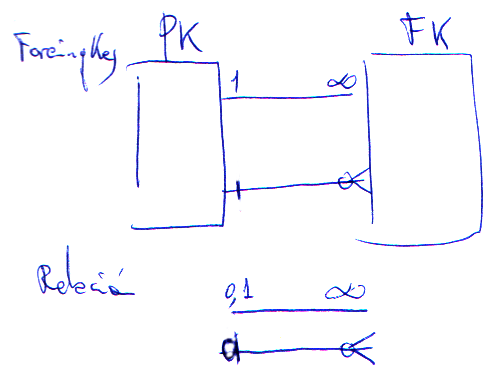

Ahora vamos a conectar a través de Entity.
Limitaciones la estructura es la misma de la tabla o un valor.
Con **LINQ** (Language INtergrated Query) Consultas integradas en el lenguaje. Es un sistema de consulta para atacar a origenes de datos.  
* Linq to objects
Una coleccion, una cadena, un array, etc...
* Linq to ADO.Net
  * Datasets.- Creo un dataset 
  * SQL (obsoleto por ser solo para MSSQL)
  * Entity,  Atacar a un modelo de datos de Entity y entity accede a cualquier servidor de base de datos, (no Access)
* Linq to XML. Cadenas o ficheros xml.

Entity es un formato que evoluciona de dataset, No hay un dataset en memoria, sino un objeto de contexto **objectContext** que permitirá mantener en memoria los datos solicitados.  
En vez de usar tablas y registros utiliza conjuntos de entidades y entidades. Donde una entidad representará la extructura de unos datos de origen y los conjuntos de entidades que serán las colecciones de instancias creadas de esos datos.  
El entity data model me permite crearme el modelo y me genera la base de datos desde mi modelo. También podemos tomar una base de datos ya creadas.  
Marcar el pincho Poner en plural o en singular los nombres de objeto generados. Conjunto en plural, elemento simple en singular.  
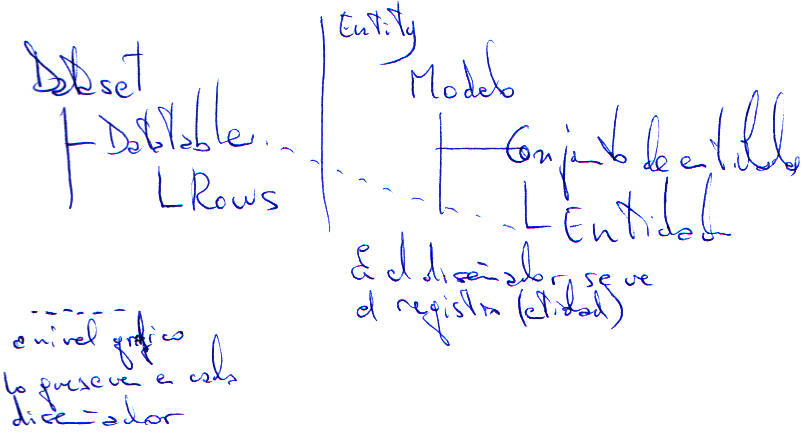  
Linq nos permite tipos anónimos que me permite definir la estructura diferente a la tabla, como si fuese una vista.  
En .NET podemos definir una variable sin deteminar el tipo que tiene, pero el compilador según los datos que le estoy pasando la define de un tipo o de otro.  
Sintaxis LINQ  
`from alias in contenedor  
[where ......]  
[order by .......]  
select proyección  `  
Detalle select  
`select proyección  `  

Todo lo que se ponga debe poderse transformar en transacsql por lo que int.parse no valdría.  
Tipos Anónimos.- En LINQ aparece la incialización y puedo con unas llaves poner el valor a cada una de las propiedades de la clase.  
`CategoriaBase cb2 = new CategoriaBase() { ID = 3, Nombre = "Klb" };`  

Una clase de tipo anónimo que no se puede tocar y no se puede ver, sin nombre, que no hay que crear porque lo hace el sistema. (Pregunta de examen).  
No es necesario poner un alias para los nombres de campo, si es un campo calculado debo ponerle un alias.  
el méto using Permite definir e instanciar una variable con la seguridad de que al salir del using se va a llamar a su método Dispose
`            //Usando using no tiene nada que ver los de cabecera.
            //Saliendo del using se destruyen los datos.
            //Llamando al metodo .Dispose()
            using(northwindModel.northwindEntities contexto = 
                new northwindModel.northwindEntities();
            {
            }  `

Si quiero añadir cosas a nuestro modelo, sobre el escritorio botón derecho, Actualizar modelo desde base de datos.  

Linq tiene ciertos métodos que tienen un icono con flechita que son métodos de extensión que añade el sistema en diseño que te permiten hacer ciertos ej filtrar, sumar, ordenar, ...)  

`                //No puedo usar p.CategoryID == int.Parse(DropDownList4.SelectedValue)
                //el int.Parse lo hago fuera de LINQ en una variable y ya funciona.`  
**Expresión Lamda** son ......... mirarlo en manual del curso anterior.  
Cuando hago una select de linq me da un IEnumerable, debo asegurarme que queda solo un registro, puedo utilizar .First .Last o .Single
si no devuelven un registro dan error, existe una variación que no da error .FirstOrDefault, .LastOrDefault, .SingleOrDefault.  
`Label1.Text += from c in contexto.Categories
                           where c.CategoryID == cat
                           select c.CategoryName;`  
Cuando dentro de una página hay controles de validación varios el control de validación de arriba me impide que se pruebe lo de abajo.  
Para poder separar las validaciones de los controles en diferentes grupos usaremos la propiedad **ValidationGroup**.  
**¿Que controles hay meter dentro de cada grupo?**  
Los controles de validación los controles validados y los controles que fuerzan la validación.  
