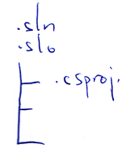

Azure
=====

  Desarrollo para la plataforma Windows Azure con Visual Studio

Orden de los cursos
-------------------
* 10267 Web Basico  
* 10264 Web Avanzado
* 10263 WCF  
* 50466 Azure  

## MODULO: 10267A: Introducción al Desarrollo Web con Microsoft Visual Studio 2010. 32 horas de duración

### CONTENIDOS TEÓRICOS
--
#### MODULO 1: EXPLORACION DE MICROSOFT APLICACIONES WEB ASP.NET EN MICROSOFT VISUAL STUDIO 2010
* Introducción al Marco. NET
* Visión general de SAP.NET
* Visión general de la aplicación del laboratorio

#### MODULO 2: CREACIÓN DE APLICACIONES WEB. MEDIANTE MICROSOFT VISUAL ESTUDIO 2010 Y MICROSOFT NET.
* Elección de un lenguaje de programacion
* Descripcion general de Visual Studio 2010
* Creación de una aplicación web simple

***23/10/2013***  
Todas las aplicaciones WEB necesitan un servidor IIS.  

#####ASP
El fichero **.asp** tiene etiquetas de HTML  
Las etiquetas de tipo `<%-------%>` lo procesará el servidor.  
Al pedir una página al servidor IIS este realiza una copia del fichero para el usuario que las ha pedido.  
El servidor procesa todas las etiquetas `<%` y una vez que ha convertido a etiquetas estandar , el servidor manda el fichero, lo borra y no espera a ninguna respuesta por parte del cliente.  
Si quiero de nuevo la página el proceso se repetirá.  

#####.NET
El fichero **.aspx**, estas páginas normalmente llevan un fichero asociado con el mismo nombre de la página  
**.aspx.cs** en visual basic **.aspx.vb**  
El servidor manda el .aspx.cs al Framework, los resultados serán para los controles del .aspx  

`<asp:TextBox .......`  


Cada vez que compilamos un proyecto crea un **Ensamblado**  

#####Solución
Conjunto de proyectos destinados a solucionar un problema.  

Siempre se va a crear una solución para trabajar con Visual Studio.  
**Ficheros:**  
**.sln** información de los proyectos que tiene que cargar Visual Studio y en que orden  
**.suo**  

Jerarquicamente de la solución cuelgan los diferentes proyectos, puede ir en diferentes directorios o no según seleccionemos.  

Por cada proyecto creará un fichero **.csproj**  


#####Proyectos Web
Un proyecto en el cual vamos a tener el fichero **.csproj, .aspx y .aspx.cs, web.config, etc...**  
Esto va a crear una DLL con todo el contenido del proyecto y todos los ficheros aspx, web.config y otros que no se compilan.  

#####Sitio Web
No hay fichero de proyecto, no va a haber ninguna DLL compilada y por defecto todo lo que está en el directorio forma parte del sitio web.  
Tienen una caracteristica mas, están pensadas para una aplicación más pequeña y **NO tienen espacio de nombres**.  

#####Nota:
Todo proyecto al compilarse va en la misma DLL, obliga a que esté todo en el mismo lenguaje.  
En los sitios web se puede mezclar la programación de diferentes lenguajes. Basicamente porque no se crea DLL, aunque existe una compilación temporal, cada pagina es una DLL en lenguaje **IL** que se recompila a binario sin distinguir ya VB o C#.  
  

Visual Studio al ejecutar un Sitio Web abre la página que estés editando.  
Si queremos que una *página sea la inicial* en el explorador de soluciones, sobre la página que queramos *botón derecho/establecer como página principal*.  
Si queremos cambiar más cosas, sobre solución boton derecho Pagina de propiedades y están todas las opciones, en Opciones de inicio están las diferentes opciones posibles.  

Que ocurre cuando pulso F5 en Visual Studio,  
El código fuente se precompila en IL automáticamente se recompila y es cuando en memoria se crea el binario.  


#####Explicacion del HTML
`<%@ Page Language="C#" AutoEventWireup="true" CodeFile="Default.aspx.cs" Inherits="_Default" %>`  

**Page** indica que es una página web  
**Language** es el lenguaje de programación en que está creado el código.  
**Codefile** En que fichero físico está la clase de esta página.  
**Inherits** Es el nombre de la clase.  
Esto funciona porque la clase está definida como **partial**.  

Existe un formato donde podemos incluir **todo en un fichero**.  
Se crea con un pinchito al crear el nuevo elemento para el sitio web.  
El cliente no recibe el código que se genera en la cabecera del fichero .aspx.  
**\<head\>** Cabecera del fichero HTML  
**\<title\>** Título de la página.  
**\<body\>** todo lo visible.  
> **\<form\>** en .NET solo puede haber un form que se ejecute en el servidor.  
**\<div\>**  

En .NET por defecto cualquier control que haga que mi pagina se envie al servidor para cualquier cosa hace que el servidor reciba esa página y que por defecto devuelva **la misma página** reprocesada.  
No hay que especificar el action en la etiqueta form porque no funciona así. El lo reconvierte automáticamente.  

#####Comentar líneas en ASPX
**\<%--     --%\>** ***No*** lo recibe el cliente en el HTML  
**\<!--     --\>**  ***Si*** lo recibe el cliente en el HTML  

#####Scripting en el cliente
Javascript que se ejecutará en el cliente sin necesidad de mandar la página al servidor hasta que es necesario.  
C# siempre se ejecutará en el servidor.  

Por defecto todos *los controles de .net guardan o mantienen el estado* es decir el valor entre peticiones.  
Los de HTML no guardan el valor entre peticiones, este comportamiento es por defecto, pero se puede cambiar en los dos.  

La etiqueta **runat="server"** permite que vea el objeto en el servidor, en este caso el valor se guarda entre peticiones, además que añade el parametro name a la etiqueta.  

***24/10/2013***    
#####Controles
* Los **CheckBox** no tienen el valor null, si no se ha rellenado el texto del checkbox nos aparece entre corchetes el nombre del control.  
* **CheckListBox** lista de checkboses.  
* **DropDownList** combobox de toda la vida, solo se puede poner texto.  
En algunos controles en la vista de visualización aparece un icono que permite cambiar configuración.  
* **FileUpload** Seleciona un fichero en un directorio del cliente. (No lo manda al servidor, se debe hacer con javascript).  
* **HiddenField** Control oculto tipico uso guardar variables.  
* **HyperLink** Hiper enlace.  
* **Image** Una imagen.  
* **ImageButton** Botón con una imagen.  
* **ImageMap** División de una imagen en regiones, y se puede pulsar una region completa.  
* **Lavel** Un texto, tiene propiedades (color, tipo de letra, y pocas más)  
* **LinkButton** Es un botón con aspecto de hipervínculo.  
* **ListBox** Solo textos, lista de testos que se pueden seleccionar.  
* **Literal** Uno de los dos únicos controles que *no añade HTML*. Tiene propiedades, pero casi nada, ni color ni fuente. Pero se puede utilizar en programación puedo calificar el texto con tag's \<b\>  
* **Localice** utilización en cuestiones de idioma.  
* **Multiview** Es un contenedor de **Views** o visualiza 1 o ninguna.  

* **Panel** Es un contenedor que se convierte en un **\<div\>**  
* **PlaceHolder** Es el otro control que *no genera HTML*. Se suele poner para en tiempo de ejecución añadir cosas. En diseño es muy pesado de manejar. (Páginas maestras).  
* **RadioButton** Tipico RadioButton. No son excluyentes entre ello. Deben estar metidos en un grupo. Todos los que tengan el mismo groupname son escluyentes entre ellos.  
* **RadioButtonList** Grupo de RadioButton.  
* **Substitution** No se utiliza. Está relacionado con la cache.  
* **Tabla** Es la misma tabla que la de HTML, es más como de trabajar en VS y se pruede utilizar en C#.  
* **TextBox** Caja de texto.  
* **Wizard** Algo parecido al Multiview pero va por pasos, tiene las pestañitas, el siguiente, anterior, etc...  
* **Xml** Permite formatear un fichero XML y transformarlo en HTML. Usando un fichero de transformación **.xslt**. Este fichero da la estructura para transformar el xml en un formato distinto, html, csv, otro xml con estructura cambiada, etc...  

####Maneras de pasar de una página a otra.
El control hiperlink encargado de cambiar de páginas.  
Utilizamos las propiedades **ImageUrl** para indicarle una imagen o **NavigateUrl** para indicarle la página. El signo **\~** indica que el objeto está colgando de la raíz del sitio.  
El **HiperLink** tiene una propiedad llamada **Target** me permite identificar donde se va a abrir ese hipervinculo. Esto es de cuando se utilizaban FRAMES. La opción _blanck nos habre una ventana nueva. (_parent, _search, _self o nada en la misma ventana, _top marco superior)  
En los **LinkButton** tiene una propiedad **PostBackUrl** permite especificar la dirección a la que queremos ir. Tiene evento **Click** y pocos más, porque se ejecutan en el **servidor**. Inconveniente este control *NO tiene la propiedad* **Target** por lo que se abre siempre en la misma ventana.  

La diferencia entre *HiperLink* y *ButtonLink*, es que el *Button* ejecuta *JavaScript* para llegar a la página, pero la forma de llamarla es diferente. El *Botón* actua como si ya estubiesemos en una pagina que ya está cargada metodo **POST**.  

####Sesión:
Es la forma que tiene el servidor de hacer el seguimiento de las peticiones de un peticionario para devolver correctamente las páginas solicitadas. Que no estamos hablando de la sesión de seguridad de una página de un banco.  
La primera petición de un cliente a un servidor **SesionId** vacío, el servidor responde con la página con una cabecera con SessionId con un número. La primera petición es de tipo **GET** a partir de este momento las peticiones son de tipo **POST** con SessionId con el número que devolvió el servidor.  


**Server.Transfer:**  
**Server** es el objeto servidor, me dá información del servidor.  
El método **Transfer** solicita la página a la que quiere ir.  
No permite poner como página una que no pertenezca al servidor. Google fallaría.  
Basicamente le estoy diciendo al servidor. **No sigas procesando esta página y procesa la que te he pedido.**  

En el Server.Transfer **la página no va a salir en la linea de direcciones**. Evitamos que el cliente pueda ver el nombre y dirección de la página que realmente le estamos enseñando. Impide poder crear un acceso directo a una página.  

**Response.Redirect** (si podemos acceder a páginas externas)  
El objeto `Response` contiene información del servidor al cliente.  
El objeto `Request` contiene la información enviada del cliente al servidor.  


En ambos casos hemos obtenido la página, si lo vemos en google con response si funciona.  
`<asp:Button ID="Button2" runat="server" Text="Server.Transfer" onclick="Button2_Click" />`
Con la palabra `onclick` indicamos la función de C# que se va a ejecutar esa función.  

Las páginas pueden ser una **primera carga** o una **recarga**. Cuando mandamos algo al servidor mandamos un **Postback**  
La propiedad [^1]**IsPostback** es la que me determina si es primera carga o es recarga.  
[^1]: Posible pregunta de examen.  

Si no es PostBack debo cargar los datos de un combobox (por ejemplo).  
Existe una propiedad **PreviusPage** es la página anterior. Es un puntero a la página anterior si la hay sino estará a **NULL** en **C#** o **NOTHING** en **VB**.  

***25/10/2013***  
####Página maestra:
Es una página especial que define una plantilla de visualización. Estará compuesta por todos los controles que queramos más **al menos dos contenedores especiales**. Esos dos contenedores seran donde se coloque todo lo que tengan las páginas que usa la página maestra.  
Uno en el **head** (no visible) y otro en el **body** (visible), en este contenedor no **puedo poner nada**. Y en la página de inicio solo puedo poner dato en este contenedor.  
Vamos a crear una página maestra.  
El nombre del fichero tiene extensión **.master**  
Las paginas maestras y las páginas que usan esa página maestra tienen que **coincidir en número de contenedores y nombre**.  
Poner los contenedores al principio o luego tendremos que cambiar todas las páginas que usen esa pagina maestra.  
El programa fusiona la hoja maestra con la que tengamos en nuestra página. El usuario no sabrá diferenciar lo que es de la página maestra de lo que no.  
Pueden tener lo que nos de la gana, siempre que pongamos el contenedor `<asp:ContentPlaceHolder id="ContentPlaceHolder1" runat="server">`.  
cada contenedor está incluido en un `<div>`.  
Para crear un formulario dependiente de la página maestra debemos marcar la opción 
La página creada solo tienen dos contenedores que son los que tenía la pagina maestra. La información solo podemos ponerla dentro de ellos.  

###Proyectos WEB
Para crear proyectos *NO nos da opción de crearlo en un servidor IIS*, luego tu ya lo subes cuando quieras. Se crea siempre en un directorio fisico.  
Hay **tres web.config** un *Debug* un *Release* y según compiles de una manera o de otra puedes tener por ejemplo diferente base de datos según sea debug o release.  
En el directorio **bin** estará la DLL.  
Ya *NO tengo opción de cambiar de lenguaje*, si la solución es C# ya no se cambia.  
####**Diferencias de la página maestra de un proyecto web y un sitio web.**  
####Proyecto WEB
```<%@ Master Language="C#" AutoEventWireup="true" CodeBehind="Site1.master.cs"  
     Inherits="ProyectoHolaMundo.Site1" %>```  
`CodeBehind` aquí  
`Inherits="ProyectoHolaMundo.Site1"` lleva espacio de nombres  
####Sitio WEB  
```<%@ Master Language="C#" AutoEventWireup="true" CodeFile="MasterPage.master.cs"  
     Inherits="MasterPage" %>```  
`CodeFile` aqui  
`Inherits="MasterPage"` nombre de la página.  
En la página de inicio también existen estas mismas diferencias  
```<%@ Page Title="" Language="C#" MasterPageFile="~/Site1.Master" AutoEventWireup="true"  
     CodeBehind="Inicio.aspx.cs" Inherits="ProyectoHolaMundo.Inicio" %>```  

###Terminado Proyectos WEB


```<%@ Page Language="C#" AutoEventWireup="true" CodeFile="Default.aspx.cs"  
     Inherits="_Default" %>```  
**AutoEventWireup** puesto a true significa que los *eventos* de página se *auto asignan* si cumplen con la *nomenclatura estandar*.  
###ViewState
Es un control en que el servidor *guarda el contenido de los controles* que usen ViewState (podemos decir a algunos que no lo usen) y que permitirá al cliente mantener los datos y al servidor *saber si ha habido cambios*.  
El control viewstate es un control **hiden** control con *información codificado no encriptado*.  
Para que un control no guarde su estado se cambia la propiedad **EnableViewState** = False. (por defecto viene en verdadero)  
Como el control está en el HTML hay que quitar la mayor información posible ya que *influye en el tráfico*.  
Tener en cuenta que el control de viewstate no tiene el valor de las cajas de texto que indiquemos, pero la propiedad value de la caja de texto tiene todavía el valor.  
Toda página web cuando se pide a un servidor se producen un grupo de eventos.  
Existen tres bloques de evento
* **Eventos de carga**  
Preinicializacion, inicializacion, carga. `Load`  
* **Eventos de cambio (0-n)**  tantos como cambios en cajas de texto, comboboxex, etc.. que haya habido. **NO se garantiza el orden de ejecución**, no programar en relación a otro cambio.  
Todos los eventos que se producen porque los controles han cambiado su valor. Pueden producirse de 0 a n.
* **Evento de acción (0-1)**  
Es el que fuerza que la página vaya al servidor.  
Hay controles que obligan eventos de acción ejemplo un botón.  
Hay controles que no forzarán nunca la acción al servidor.  
Otros como programador decides si van o no al servidor, ejemplo un combo, un listbox, etc...  
En los controles editables se le suele poner la propiedad **EnableViewState** a true.  
La propiedad **IsPostBack** de la pagina nos indica si es una *recarga* o se carga por *primera vez*.  
Si un control **HiddenField** le cambiamos la propiedad *Visible* a false, deja de verse en el HTML, la funcionalidad sigue porque está todavía en el *ViewState*.  

Todo lo que se crea en el servidor termina perdiendose.  
Hay dos sitios en los que podemos guardar el estado. El cliente y el servidor.  
Cuando guardamos el estado en el *cliente*, significa que enviamos la información desde el servidor al cliente. Eso implica HTML o similar y eso limita a que el contenido sea *texto*.  
Se podría mandar una *instancia* siempre que podamos *serializarla*  
Cuando guardamos el estado en el *servidor*, podemos guardar información entre peticiones. Y al ser el servidor quien la guarda, podrá guardar *cualquier tipo que pueda manejar*. (Cadena, número, array, instancia, dataset, etc...)  

###Mecanismos o formas para guardar datos en cliente y en servidor.
Cliente      | Servidor
------------ | --------
ViewState    | Estado de Sesión
HiddenField  | Estado de Aplicación
ControlState | Cache (no la típica)
Cookies      | 
QueryString  | 

**ControlState.-** Lo gestiona automáticamente  
**Cookies.-** Pequeños ficheros no suelen llegar a 1 kb. que se envían del servidor al cliente con información.  
**QueryString.-** Son cadenas que se añaden a la petición de la página. Siempre son visibles. El truco para que no se vea es utilizar el **ServerTransfer** y de esa forma no se ve la línea de comandos web.  
Cookies y querystring no van en el HTML  

Existen dos maneras de ver las cookies:

Por su **contenido** las simples y las compuestas.  
* Simple.- la que guarda solo un contenido.
* Compuesta.- En luegar de tener un value será un diccionario, de 1 a n valores.  

Con respecto a su **duración**.  
* Temporales.- Están en memoria del navegador y se pierden al cerrar este.
* Permanentes.- Se guardan en disco, la ubicación depende del navegador.

Toda cookie simple puede ser temporal o permanente y compuesta igual.  
Se crea la *cookie* como nuevo objeto, pero para *mandarla* del servidor al cliente la añadimos al objeto *Response* con `Response.Cookies.Add(c);`  

