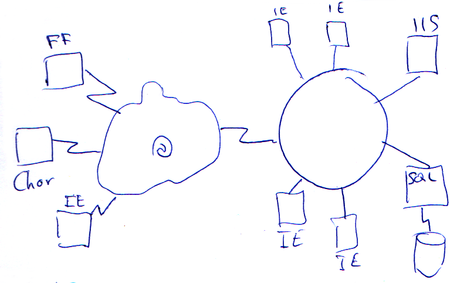

###Seguridad Membership

**Authentication**.- La autentificación es el proceso por el que establecemos **la forma** en que validaremos al usuario. Hay cuatro valores:

* **Windows**.- El sistema tratará de obtener la información del **token** *(información del usuario de Windows, nombre, etc...)* del usuario de windows. Eso tiene la ventaja de que si el usuario está validado vía Windows no le pide autenticarse/validarse. Inconveniente solo funciona en un cliente Windows, ni Mac ni Linux, el cliente no tiene las librerías para que salga la ventana que pregunta el usuario y la contraseña.
* **Forms**.- Redirige a un formulario Web, para validarnos. Ventaja es una página web, es valido para cualquier usuario de cualquier sistema al ser un HTML. El inconveniente hay que hacer algún tipo de mantenimiento de usuarios.
* **Passport**.- Sistema de validación gestionado por Microsoft, que permite una única validación para diferentes aplicaciones y servicios. Ejemplo Hotmail, Drive, etc... esto se gestiona con passport una única contraseña/cliente. Se puede pedir a Microsoft, se instala en tu servidor IIS y funciona, (No se sabe si es de pago o libre).
* **None**.- No es ninguna de las anteriores. Permite que te configures tu propia gestión de seguridad que no usará ninguno de los formatos anteriores.

El valor por defecto es *Windows*.

**Authorization**.- Que es el proceso por el cual determinamos quienes pueden y quienes no pueden acceder a la aplicación o a parte de ella.

* IPrincipal.- Entidad principal que agrupa la seguridad.
   * IsInRole.- Pertenece al grupo.
   * IIdentity.- Información del usuario.
      * IsAuthenticated.- Esta autenticado.
      * AuttenticationType.- Tipo de autentication (Windows, Forms, Passport, None)
      * Name.- Nombre del usuario que puede ser lo que hemos tecleado o no, (lo lógico es que lo sea)

Controles de Membership

* **LoginName**.- Visualiza el nombre del usuario como una etiqueta (label), si no esta autenticado sale vacío.
* **LoginView**.- Este control es un MultiView con 2 vistas concretas.
   * Tiene una vista para cuando el usuario está validado.
   * Otra vista para cuando no está validado.
* 