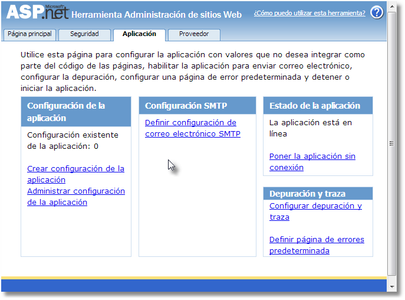
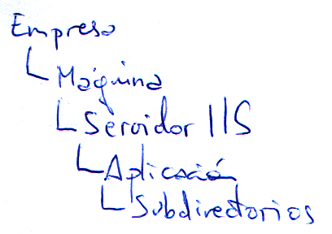
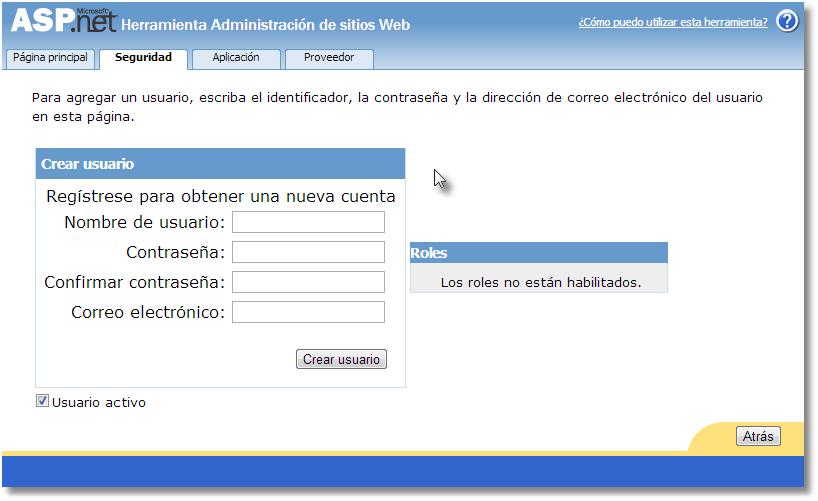

###Seguridad Membership

**Authentication**.- La autentificación es el proceso por el que establecemos **la forma** en que validaremos al usuario. Hay cuatro valores:

* **Windows**.- El sistema tratará de obtener la información del **token** *(información del usuario de Windows, nombre, etc...)* del usuario de windows. Eso tiene la ventaja de que si el usuario está validado vía Windows no le pide autenticarse/validarse. Inconveniente solo funciona en un cliente Windows, ni Mac ni Linux, el cliente no tiene las librerías para que salga la ventana que pregunta el usuario y la contraseña.
* **Forms**.- Redirige a un formulario Web, para validarnos. Ventaja es una página web, es valido para cualquier usuario de cualquier sistema al ser un HTML. El inconveniente hay que hacer algún tipo de mantenimiento de usuarios.
* **Passport**.- Sistema de validación gestionado por Microsoft, que permite una única validación para diferentes aplicaciones y servicios. Ejemplo Hotmail, Drive, etc... esto se gestiona con passport una única contraseña/cliente. Se puede pedir a Microsoft, se instala en tu servidor IIS y funciona, (No se sabe si es de pago o libre).
* **None**.- No es ninguna de las anteriores. Permite que te configures tu propia gestión de seguridad que no usará ninguno de los formatos anteriores.

El valor por defecto es *Windows*.

**Authorization**.- Que es el proceso por el cual determinamos quienes pueden y quienes no pueden acceder a la aplicación o a parte de ella.

* IPrincipal.- Entidad principal que agrupa la seguridad.
   * IsInRole.- Pertenece al grupo.
   * IIdentity.- Información del usuario.
      * IsAuthenticated.- Esta autenticado.
      * AuttenticationType.- Tipo de autentication (Windows, Forms, Passport, None)
      * Name.- Nombre del usuario que puede ser lo que hemos tecleado o no, (lo lógico es que lo sea)

Controles de Membership

* **LoginName**.- Visualiza el nombre del usuario como una etiqueta (label), si no esta autenticado sale vacío.
* **LoginView**.- Este control es un MultiView con 2 vistas concretas. Y se enseñan de forma automática.
   * Tiene una vista para cuando el usuario está validado.
   * Otra vista para cuando no está validado.

* **LoginStatus**.- Este control muestra un link para forzar la validación/autenticación de usuario o para cerrar/abandonar la sesión de seguridad. Que NO es la sesión de SessionID. (Caduca la cookie de seguridad).

   Se puede configurar con la propiedad LoginAcction

   * **Refresh**.- recarga la página actual.
   * **Redirect** permite redirigir a una página concreta expecificada en la propiedad **LogoutPageUrl**.
   * **RedirectToLoginPage**.- redirecciona a la página de Login.
 
* **Login**.- Permite validar al usuario.
* **CreateUserWizard**.- Asistente para crear usuarios, normalmente vía Membership.
* **ChangePassword**.- Permite al propio usuario cambiar su password, normalmente vía Membership.
* **PasswordRecovery**.- Permite reinicializar la password a un valor generado por el sistema, que será enviado por correo electrónico al usuario, forzando a que la cambie nada más entrar (porque es una password caducada), normalmente vía Membership.

###Configuración Web.Config.

Hay una herramienta que nos ayuda a tocar este fichero con mayor facilidad.  

Todas estas conexiones viene del fichero machine.config

Podemos guardar valores de configuración de aplicación.

Poner la aplicación sin conexión, estado en el servidor IIS.

Podemos poner el Debug true o false para la depuración en Visual Studio.

Depuración y traza.
La traza es una salida o bien por pantalla directamente en las páginas que me interese, o bien en un archivo temporal en el servidor. Que no existe en disco, solo está en memoria y se llama **trace.axd** se vería en el navegador en lugar de la página de inicio con el nombre indicado.

Se pueden ver cookies, variables de sesión, etc...

Definir página de errores predeterminada.

Si lo que falla es la aplicación se ejecuta el Page_Error o el application_Error.

Esto es para los errores 400 Página no existe, pues ponemos la página que queremos que nos enseñe. Son peticiones de HTTP las que están fallando.

**Seguridad**

Automáticamente me ha creado la conexión a la base de datos. En App_Data ha creado **ASPNETDB.MDF**

Si no hemos terminado no ha creado todavía de crear nada.

**Usuario:** curso  
**Password:** QWERTY1!

Segundo usuario:

**Usuario:** curso2  
**Password:** asdfg

Entramos en el **web.config** y vemos que nos ha añadido el siguiente código:

    <appSettings>
      <add key="Profesor" value="Javier" />
      <add key="Alumno" value="Carlos" />
    </appSettings>

y escondido en system.web

    <authentication mode="Forms" />

Si ejecutamos directamente al inicial sesión nos da un error Dirección URL solicitada: /SitioHolaMundo/login.aspx

La página que busca es login.aspx. Para cambiarlo he de cambiar la anterior etiqueta y quedaría:

    <authentication mode="Forms">
      <forms loginUrl="~/Admin/formLogin.aspx" />
    </authentication>

Podemos acceder a los datos de aplicación modificados en el web.config con:

    System.Configuration.ConfigurationManager
          .AppSettings["Profesor"]

**Para autenticar sin membership**

Vamos a hacer que se mande una cookie de seguridad al servidor.

Hay que usar un método estático **RedirectFromLoginPage** de un objeto especial **System.Web.Security.FormsAuthentication**.

    System.Web.Security.FormsAuthentication
          .RedirectFromLoginPage(TextBox1.Text, false);

En la segunda sobrecarga podemos decir que la cookie sea permanente o no.

###Autorización.

Se va a basar en una jerarquía de paso. hay que pasar por Empresa, Maquina, Servidor IIS, Aplicacion, si no pasas por una ya no pasas los siguientes controles.

* Empresa (Seguridad a nivel general, seguridar de dominio)
* Maquina (Seguridad a nivel de máquina **machine.config**)
* Servidor IIS (Hasta aquí no limita nada, normalmente)
* Aplicacion (validado o anónimo, a nivel de **web.config**)  
  **allow** es para permitir explícitamente a usuarios o grupos de usuarios (roles).  
  **deny** es para denegar explícitamente a usuarios o grupos de usuarios (roles).  
  Hay dos comodines `?` Anonimos, `*` Todos  
* Subdirectorios  

        <authentication mode="Forms">
          <forms loginUrl="~/Admin/formLogin.aspx" />
        </authentication>
        <authorization>
          <deny users="?"/>
        </authorization>

En este bloque la seguridad va en el orden en el que se lo encuentra.

En el caso
 
    <allow users="*" /> permite a todo el mundo
    <deny users="?" />  excluye a los anónimos.

Al permitir a todo el mundo ya entraría y no comprobaría nada.

En este otro caso

    <deny users="?" />  excluye a los anónimos.
    <allow users="*" /> permite a todo el mundo

Exige que estés logado *(no permite anónimos)*.
Y luego puede entrar cualquiera.

Este caso comprobaremos el orden de las instrucciones.

    <deny users="?" />  excluye a los anónimos.
    <deny users="Pepe" />  excluye a Pepe.
    <allow users="*" /> permite a todo el mundo

En este caso Pepe no entra.

Sin embargo en este otro

    <deny users="?" />  excluye a los anónimos.
    <allow users="*" /> permite a todo el mundo
    <deny users="Pepe" />  excluye a Pepe.

Pepe entra porque antes le han dejado entrar.

###Seguridad por páginas.
En el web.config fuera de la sección `<configuration>` la etiqueta `<location>` permite poner configuración especial a páginas concretas, de una en una, no hay comodines. La página se indica con el parámetro **path** sin indicarle `~/` son todas del directorio principal.

Antes de aplicar lo general aplicamos lo individual. Como hemos dado derecho a la página a todo el mundo ya no va a mirar la seguridad general.

Ejemplo:

	<!--Derechos de páginas-->
	  <location path="Inicio.aspx">
	<!--Bloque de autorización-->
	    <system.web>
	      <authorization >
	        <allow users="*"/>
	      </authorization>
	    </system.web>
	  </location>
	
	<!--Derechos generales-->
	  <system.web>
	    <authentication mode="Forms">
	      <forms loginUrl="~/Admin/formLogin.aspx" />
	    </authentication>
	    <authorization>
	      <deny users="?"/>
	      <!--<allow users="*"/>-->
	    </authorization>

Con controles de inicio de sesión. Poniendo el control `Login` tira por defecto del controlador de la base de datos ASPNETDB.MDF que viene configurado ya en el `/windows/Microsoft.NET/Framework/v4.0.../Config/machine.config`.

    <asp:Login ID="Login1" runat="server">
    </asp:Login>

Proveedor en machine.config

	<membership>
		<providers>
			<add 
			name="AspNetSqlMembershipProvider"
			type="System.Web.Security.SqlMembershipProvider, System.Web, Version=4.0.0.0, Culture=neutral, PublicKeyToken=b03f5f7f11d50a3a" 
			connectionStringName="LocalSqlServer"
			enablePasswordRetrieval="false"
			enablePasswordReset="true"
			requiresQuestionAndAnswer="true"
			applicationName="/"
			requiresUniqueEmail="false"
			passwordFormat="Hashed"
			maxInvalidPasswordAttempts="5"
			minRequiredPasswordLength="7" 
			minRequiredNonalphanumericCharacters="1" 
			passwordAttemptWindow="10" 
			passwordStrengthRegularExpression=""/>
		</providers>
	</membership>

No hay que poner todas, pero hay más.

Te puedes crear otro proveedor incluso otra conexión y podríamos utilizar este nuevo proveedor en mi aplicación web.

Veamos el código en el web.config.

	  <!--Derechos generales-->
	  <system.web>
	    <membership defaultProvider="MiSqlMembershipProvider">
	      <!--Este proveedor de Membership es para que lo veamos en configuración
	      y veamos que se pueden tener varios.
	      En este voy a "relajar" las limitaciones de la password.-->
	      <providers>
	        <add connectionStringName="LocalSqlServer" enablePasswordRetrieval="false"
	          enablePasswordReset="false" requiresQuestionAndAnswer="false"
	          applicationName="/" requiresUniqueEmail="false" passwordFormat="Hashed"
	          maxInvalidPasswordAttempts="5" minRequiredPasswordLength="5"
	          minRequiredNonalphanumericCharacters="0" passwordAttemptWindow="10"
	          passwordStrengthRegularExpression="" name="MiSqlMembershipProvider"
	          type="System.Web.Security.SqlMembershipProvider, System.Web, Version=4.0.0.0, Culture=neutral, PublicKeyToken=b03f5f7f11d50a3a" />
	      </providers>
	    </membership>

Al cambiar de proveedor por defecto ahora apunta a nuestro proveedor `membership defaultProvider="MiSqlMembershipProvider"`

Ya no me pide la pregunta/respuesta de seguridad y las limitaciones del password también han cambiado.

Login SIN Membership y con controles de INICIO DE SESION

El control Login tiene eventos.

* **LoggingIn**.- se produce antes de hacer la validación.
* **LoggedIn**.- se produce cuando se ha validado el usuario correctamente.
* **LoginError**.- se produce cuando se ha validado el usuario de forma incorrecta.

Esto funciona en validación via membership o manualmente.

Manualmente tenemos que capturar uno más **Authenticate** este fuerza la validación manual.

Dentro del evento el argumento de **e.Authenticated** si la ponemos a true da por hecho que hemos autenticado bien.

Si el control tiene asignado el evento **Authenticate** la validación ya no se hace automáticamente.

En la variable **e** tenemos el argumento **cancel** me permite cancelar el logeado.

Propiedades del control Login:

* **Username**.- Usuario que se ha introducido en el control.
* **Password**.- La password que ha introducido en el control.

Si la llamada a la página la hacemos con Server.Transfer se salta la seguridad de la página.

