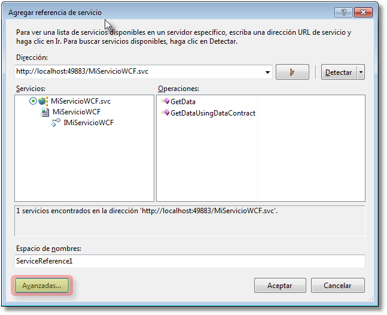

##Servicios WCF

Últimamente empiezan a existir muchos servidores sirviendo información.

**Servicios Web (Web Services).**.- Son aplicaciones accesibles vía HTTP orientadas a devolver datos (normalmente), puede también existir para recibir información. Son anteriores a .NET. .NET a utilizado una tecnología que ya existía.

Intercambio de datos entre aplicaaciones.- Punto a punto, web services, netbios, colas de mensajes (ejemplo claro de cola de mensajes el correo, o el washapp).

El problema es que había muchos formatos de conexión. Microsoft a través de WCF (Windows communication Fundation) han unificado todos en uno como una cebolla.

Todo lo haremos con WCF la metodología sería igual, y luego le indicaremos que formatos queremos usar.

WCF Service via http, es el que vamos a usar.
Cuando creemos el servicio nos vamos a encontrar:

Un fichero con extensión .svc que será nuestro punto de entrada y su correspondiente .svc.cs

Además tendremos un interface I_____.cs es el que me va a determinar que es lo qu3e va a hacer o no.

De cara a internet vamos a tener expuesto desde mi interface, es lo que vamos a ver desde fuera.

Los servicios WCF puede ser llamado desde un cliente Web o cliente windows u otro servicio.

Todo servicio tiene que estar hospedado o cargado por alguna aplicación o servicio.

Crearemos una nueva solución en el Visual Studio. Con dos proyectos.
El proyecto de servicio utilizaremos la plantilla **Aplicación de Servicios WCF C#**.

Al crear nos ha creado dos métodos de ejemplo GetData y GetDataUsingDataContract y el tipo CompositeType pertenece a una clase de ejemplo IService1.cs. Todo esto no nos sirve de nada.

En el fichero Service1.svc nos viene esta información.
  <%@ ServiceHost Language="C#" Debug="true" Service="ServicioWCF.Service1" CodeBehind="Service1.svc.cs" %>

Creamos un proyecto Web con la plantilla Aplicacion web vacía ASP.NET.

Para cualquier aplicación que quiera utilizar un servicio WCF (en general) hace falta crear en la aplicación cliente un conjunto de clases para poder instanciar y utilizar el servicio. Si lo hacemos desde Visual Studio es lo que se llama referencia de servicio. Y lo llamaremos **Proxy**. Tendremos la clase de servicio como tal, así como todas las clases o tipos que podamos necesitar.

Si le paso un id y me devuelve un producto, en mi cliente el proxy tiene que tener una definición que entienda los que es un producto.

En ClienteWCF en references le damos agregar referencia de servicio.
Podemos detectar los servicios de la solución (antes hay que compilar/generar).

Cuidado hay que compilar porque sino no actualiza la información que detectaría.

Puedo cambiar el nombre del fichero pero no me ha cambiado el nombre del interface y el nombre de la clase se puede cambiar con Refactorizar.

Modificadores de las clases de los interfaces ([ServiceContract], [DataContract]. Indican que método del interface se muestra desde fuera del servicio. Me permiten modificar el comportamiento del método, clase, interface.

Ejemplo:

    [ServiceContract]
    public interface IService1

    ...

    [DataContract]
    public class CompositeType

Atributos:

ServiceContract.- Para que el interface se exponga en el servicio debe tener este atributo.
OperationContract.- Para que un métodos que queramos exponer en el interface deben tener el atributo.

El servicio puede tener más interfaces que no se expongan al exterior y métodos también.

Estos atributos pueden ser modificados con parámetros por nombre y por ejemplo puedo cambiar el nombre del interface.

    [ServiceContract(Name="IMiServicioWCF")]
    public interface IService1

Esto me muestra el nombre al exterior cambiado a IMiServicioWCF.

En el servicio que implementa el interface lo mismo.

    [ServiceBehavior(Name="MiServicioWCF")]

Esta pantalla no es para agregar servicios web. Debería entrar en Avanzadas y pulsar el botón de Compatibilidad Agregar referencia web.

Para usarlo en el cliente:

            //Clase creada en el cliente del servicio
            ProxyWCF.MiServicioWCFClient s = new ProxyWCF.MiServicioWCFClient();
            //Si el contenido de la caja de texto petará
            Label1.Text = s.GetData(int.Parse(TextBox1.Text));

