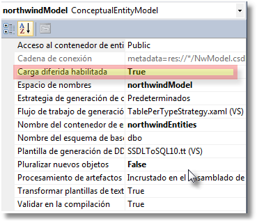

##Servicios WCF

Últimamente empiezan a existir muchos servidores sirviendo información.

**Servicios Web (Web Services).**.- Son aplicaciones accesibles vía HTTP orientadas a devolver datos (normalmente), puede también existir para recibir información. Son anteriores a .NET. .NET a utilizado una tecnología que ya existía.

Intercambio de datos entre aplicaaciones.- Punto a punto, web services, netbios, colas de mensajes (ejemplo claro de cola de mensajes el correo, o el washapp).

El problema es que había muchos formatos de conexión. Microsoft a través de WCF (Windows communication Fundation) han unificado todos en uno como una cebolla.

Todo lo haremos con WCF la metodología sería igual, y luego le indicaremos que formatos queremos usar.

WCF Service via http, es el que vamos a usar.
Cuando creemos el servicio nos vamos a encontrar:

Un fichero con extensión .svc que será nuestro punto de entrada y su correspondiente .svc.cs

Además tendremos un interface I_____.cs es el que me va a determinar que es lo qu3e va a hacer o no.

De cara a internet vamos a tener expuesto desde mi interface, es lo que vamos a ver desde fuera.

Los servicios WCF puede ser llamado desde un cliente Web o cliente windows u otro servicio.

Todo servicio tiene que estar hospedado o cargado por alguna aplicación o servicio.

Crearemos una nueva solución en el Visual Studio. Con dos proyectos.
El proyecto de servicio utilizaremos la plantilla **Aplicación de Servicios WCF C#**.

Al crear nos ha creado dos métodos de ejemplo GetData y GetDataUsingDataContract y el tipo CompositeType pertenece a una clase de ejemplo IService1.cs. Todo esto no nos sirve de nada.

En el fichero Service1.svc nos viene esta información.
  <%@ ServiceHost Language="C#" Debug="true" Service="ServicioWCF.Service1" CodeBehind="Service1.svc.cs" %>

Creamos un proyecto Web con la plantilla Aplicacion web vacía ASP.NET.

Para cualquier aplicación que quiera utilizar un servicio WCF (en general) hace falta crear en la aplicación cliente un conjunto de clases para poder instanciar y utilizar el servicio. Si lo hacemos desde Visual Studio es lo que se llama referencia de servicio. Y lo llamaremos **Proxy**. Tendremos la clase de servicio como tal, así como todas las clases o tipos que podamos necesitar.

Si le paso un id y me devuelve un producto, en mi cliente el proxy tiene que tener una definición que entienda los que es un producto.

En ClienteWCF en references le damos agregar referencia de servicio.
Podemos detectar los servicios de la solución (antes hay que compilar/generar).

Cuidado hay que compilar porque sino no actualiza la información que detectaría.

Puedo cambiar el nombre del fichero pero no me ha cambiado el nombre del interface y el nombre de la clase se puede cambiar con Refactorizar.

Modificadores de las clases de los interfaces ([ServiceContract], [DataContract]. Indican que método del interface se muestra desde fuera del servicio. Me permiten modificar el comportamiento del método, clase, interface.

Ejemplo:

    [ServiceContract]
    public interface IService1

    ...

    [DataContract]
    public class CompositeType

Atributos:

ServiceContract.- Para que el interface se exponga en el servicio debe tener este atributo.
OperationContract.- Para que un métodos que queramos exponer en el interface deben tener el atributo.

El servicio puede tener más interfaces que no se expongan al exterior y métodos también.

Estos atributos pueden ser modificados con parámetros por nombre y por ejemplo puedo cambiar el nombre del interface.

    [ServiceContract(Name="IMiServicioWCF")]
    public interface IService1

Esto me muestra el nombre al exterior cambiado a IMiServicioWCF.

En el servicio que implementa el interface lo mismo.

    [ServiceBehavior(Name="MiServicioWCF")]

Esta pantalla no es para agregar servicios web. Debería entrar en Avanzadas y pulsar el botón de Compatibilidad Agregar referencia web.

Para usarlo en el cliente:

            //Clase creada en el cliente del servicio
            ProxyWCF.MiServicioWCFClient s = 
				new ProxyWCF.MiServicioWCFClient();
            //Si el contenido de la caja de texto está vacía, petará.
            Label1.Text = s.GetData(int.Parse(TextBox1.Text));

Se pone el cliente como proyecto por defecto y la página WebForm1.aspx como página de inicio.

Que ha ocurrido al ejecutar.

Mi aplicación entra y al pulsar el botón hace un PostBack para el uso del servicio vemos en el web.config lo que nos ha creado.

Cuando hago la petición lanza de un IIS a otro IIS la petición si el servicio no está arrancado lo pone en marcha ejecuta todo el código devuelve la petición al servidor IIS, el servidor IIS del servicio pierde todo lo que ha creado.

    <system.serviceModel>
        <bindings>
            <basicHttpBinding>
                <binding name="BasicHttpBinding_IMiServicioWCF" />
            </basicHttpBinding>
        </bindings>
        <client>
            <endpoint address="http://localhost:49883/MiServicioWCF.svc"
                binding="basicHttpBinding" bindingConfiguration="BasicHttpBinding_IMiServicioWCF"
                contract="ProxyWCF.IMiServicioWCF" name="BasicHttpBinding_IMiServicioWCF" />
        </client>
    </system.serviceModel>

El contract es el interface.

Pilares de los servicios WCF (el **ABC**).

**Address**.- La dirección que está el servicio

`<endpoint address="http://localhost:49883/MiServicioWCF.svc"`

**Binding**.- Tipo de conexión contra el servicio.

        <bindings>
            <basicHttpBinding>
                <binding name="BasicHttpBinding_IMiServicioWCF" />
            </basicHttpBinding>
        </bindings>

**Contract**.- El interface del servicio que estamos usando.

Un mismo servicio se pueden exponer con diferentes Binding seguramente necesitará diferentes interfaces.

Todos los métodos que me cree en el interface tendré que implementarlo en la clase.

Para crear la **enumeración** en el servicio agrego un elemento tipo código con la plantilla **Archivo de código de Vicual C#**.

En un **switch** es necesario el **break** si la ejecución continua, si me salgo con **return** no sería necesario.

Las sobrecargas de métodos en clases no dan ningún problema en las clases. Pero en los servicios no puede haber dos métodos con el mismo nombre.

La forma de enviar las peticiones y devolver los datos no puede estar limitado a una plataforma, la norma que siguen el protocolo **SOAP** *(Simple Object Access Protocol)* que utilizan etiquetas **XML** para envolver todo lo que se envía. En este caso en nuestra aplicación el servidor es IIS, que mandará los datos al cliente en formato HTML.

En *SOAP no se admiten sobrecargas*. Utilizo en la etiqueta OperationContract el parámetro Name y cambio el nombre del método del Servicio.

        [OperationContract(Name="FechaD")]
        string Fecha(enumTipoFecha tipoFecha);

###Datos

La base de datos estará en el Proyecto del Servicio.

Utilizaremos en primer caso Datasets.

Visual C#, Datos, plantilla Conjunto de Datos.

Todas las conexiones generadas por mi siempre se mantendrán creadas.

Al pasar la primera tabla al Dataset me pregunta si copia la BBDD al proyecto como local y cambiar automáticamente la cadena de conexión.
El web.config de el servicio queda así.

	  <connectionStrings>
	    <add name="northwindConnectionString" 
		  connectionString="Data Source=.\SQLEXPRESS;
			AttachDbFilename=|DataDirectory|\northwind.mdf;Integrated
			Security=True;Connect   Timeout=30;User Instance=True"
	      providerName="System.Data.SqlClient" />
	  </connectionStrings>
 
Serializar consiste en convertir una instancia en datos. En el caso del ejemplo tiene que serializarse en xml.

La tableRow no se puede serializar. La tabla si se puede serializar, solución más sencilla crearnos una clase y esta si se serializa.

Cuando regenero el proxy me crea la clase y las propiedades (datos/xml/serialización) pero no los métodos (nada de código de la clase de origen), propiedades con sus metodos get/set sin código (verificación de que sea positivo, etc...). Pregunta de examen.

El GAC (Global Assambly Cache) es un conjunto de directorios que contienen librerías de .NET compartidas o comunes a varias aplicaciones. Es un directorio o conjunto de directorios donde están todas las librerías del Framework de todas las versiones instaladas están en el GAC.

Para subir una librería al GAC tiene que cumplir un requisito, tiene que estar firmada digitalmente.

Para subir luego la librería al GAC hay crear un proyecto de distribución.

En el servicio al usar ADO Conectado no puedo devolver un DataReader porque cuando pase la información, que es un puntero perdería los datos.

Métodos para optimizar la lectura del DataReader, ExecuteReader tiene una segunda sobrecarga que con System.Data.CommandBehavior. .....)
* CloseConnection.- cuando termine de leer que cierre la conexión automáticamente
* SequentialAccess.- Cuando hay muchos datos optimiza la memoria.
* SingleRow.- Para cuando solo hay que pedir un registro.

En el **DataReader** podemos saber si hay registros con **HasRows** pero no ha leído nada, siempre hay que hacer un **Read()** para leer el registro siguiente.

Modificación de un Dataset.

En la barra de controles.

* DataTable.- Tabla simple sin TableAdapter.
* Query.- Consultas que no traen registros. (executenonquery o executexcalar)
* Relaciones.- Para crearlas nuevas si no están ya creadas.
* TableAdapter.- Me añade la tabla y las diferentes consultas (Llenar, Obtener, Update, Insert, Delete, y las consultas auxiliares.

Un tableAdapter siempre tiene las mismas columnas.

Simultaneidad optimista revisa la concurrencia, si habilitamos la concurrencia revisaría que todos los campos no hallan sido modificados desde la lectura a la reescritura del registro. Sino solo revisa ID.

Actualizar tabla de datos, después de un insert hace un select para saber el número de Id que le ha dado al nuevo registro.

Una relación a diferencia de una ForeignKey no me obliga a cargar los datos en las dos tablas de la relación.

Eventos del Control **DropDownList**

* **DataBinding**.- Evento que se produce justo antes de realizar el enlace con los datos.
* **DataBound**.- Se ejecuta nada más realizar el enlace con los datos.

A diferencia de un Dataset que crea una tabla y rellena los datos y pierde la conexión. Pero mantiene la tabla. En Entity se cierra la conexión y cuando intento meterlos en el DropDownList que es cuando los necesito ya no está abierta. Tenemos que forzar a que lea los datos antes de cerrar la conexión. Se fuerzan con ToList, ToArray, ToDictionary (Pregunta de examen) a que los datos se lean.

En entities es necesario poner la propiedad contexto.ContextOptions.**LazyLoadingEnabled** *(carga diferida)* a false porque entities si trato de acceder a un registro va a intentar traerse todos las propiedades de navegación en el caso de pedidos, tratará de cargar por pedido todas las líneas del pedido que se ha cargado. Si está a false esto no lo hace. (Pregunta de examen)

Control de errores en Servicios con Entities.
Las FaultException existen tambien como tipo genérico, le puedo mandar una información que tiene un contenido le puedo mandar cualquier cosa, clase, etc...
Cada vez que vayaamos a enviar una FaultException con contenido personalizado en el método del interface tenemos que indicárselo.

Al no encontrar el pedido en el servidor ha encontrado un error y ha mandado un error diferente al cliente.

**SOAP** tiene una clase que se llama **FaultException** para *gestionar los errores*.

Habilitar en el Web.config del servicio, para que en lugar de mandar el FaultException que mande una excepción de .NET. (Solo valido si el cliente va a ser .NET, también es cómodo para revisión de código).

        <behavior>
          <!-- Para evitar revelar información de los metadatos, establezca el valor siguiente en false y quite el extremo superior de los metadatos antes de la implementación -->
          <serviceMetadata httpGetEnabled="true" />
          <!-- Para recibir detalles de las excepciones en los fallos, con el fin de poder realizar la depuración, establezca el valor siguiente en true. Para no revelar información sobre las excepciones, establézcalo en false antes de la implementación -->
          <serviceDebug includeExceptionDetailInFaults="false" />
        </behavior>

Lo sigue mandando con FaultException pero el mensaje es correcto (es el mismo que da el servidor. **En producción dejarla siempre a false**.

Se captura en el servidor el error y se reconvierte a una excepcion de tipo FaultException y ya es compatible con todos los clientes.

Creamos una clase ClaseErrorGeneral
con propiedades 
string operacion
string mensaje
En el fichero clases datos.

    [OperationContract]  
    [FaultContract(typeof(ClaseErrorGeneral))]  

Existe un atributo FaultContract que debemos indicar a continuaciíon de OperatinoContract hay que indicar el tipo del detalle a enviar.

En **Detail** en el cliente, se devuelve el objeto que he creado para devolvel en la excepción.

Vamos añadir a la ClaseErrorGeneral que pueda enviar una excepción.

Tipos de configuraciones de servicio.

* PerCall.- Por llamada, es un servicio que crea una instancia por cada llamada. Liberandola tras su uso. *(valor por defecto)*. Hago una llamada obtengo mis dados y los visualizo.
* PerSession.- Por sesión, mantiene la instancia del servicio mientras mantengamos el Proxy en memoria (en cliente oviamente). Cuando voy a hacer actualizaciones y por cada uno de ellos tengo que hacer una actualización, inserción. Si mantengo el proxy abierto para hacer todas seguidas.
* Single Una única instancia para todos los usuarios.
 
Son excluyente o son de un tipo o son de otro.
Añadimos Servicio WCF con nombre ServicioPerCall, ServicioPerSession y ServicioSingle

Para que sea de solo lectura 
Refactorizo encapsular campo el campo _Creacion en Creación.

